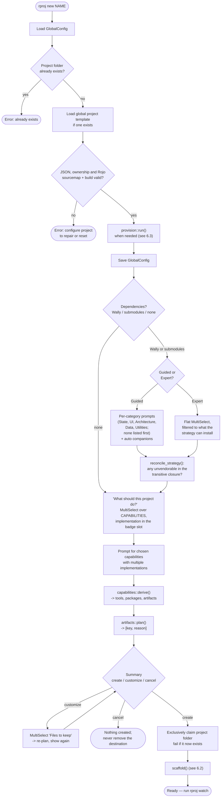
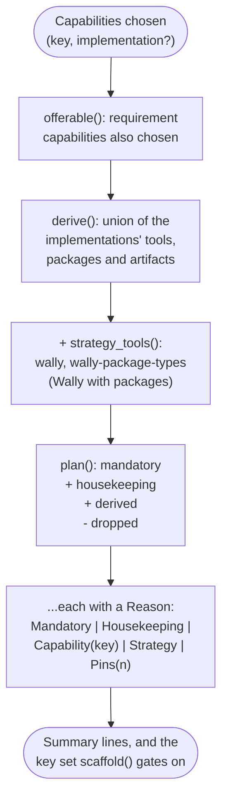
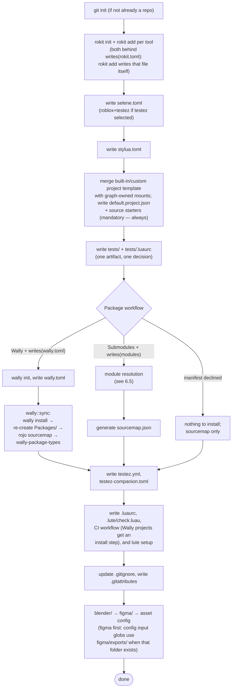
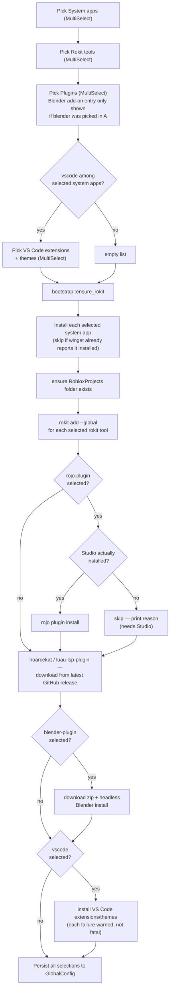
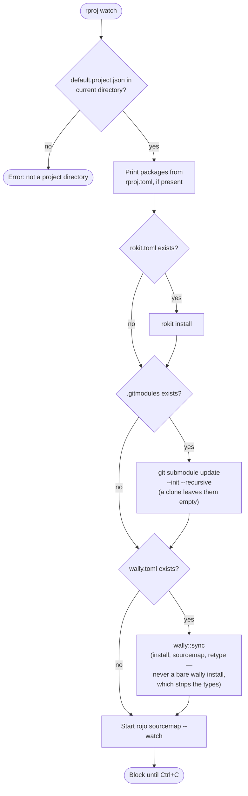
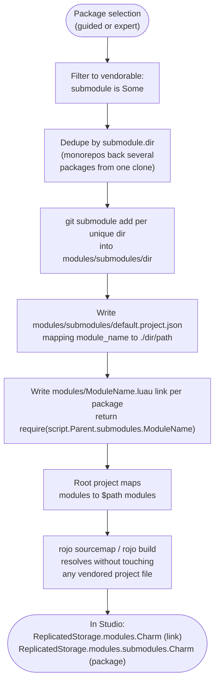

# rproj — Architecture

## 1. System Overview

`rproj` is a Rust command-line tool (crate name `rproj`, binary `rproj`) that takes a fresh Windows PC to a working Roblox game-development setup and scaffolds individual Roblox/Luau projects on top of it. It replaces manually installing and configuring Git, VS Code, Roblox Studio, the Roblox client, Blender, and the Rojo/Wally/Rokit/Selene/StyLua toolchain one at a time.

Every choice `rproj` presents — which system app, which CLI tool, which Studio plugin, which VS Code extension, which Roblox package — is shown with a plain-language description and a maintenance-status badge, so a newcomer is guided toward a working, professional setup without needing to already know the ecosystem, while an experienced developer can move through the same prompts quickly by picking exactly what they want.

Interactive bare `rproj` is a workspace hub over the existing commands. It reports machine, template, saved-setup, update, and exact-current-directory project state, but it does not absorb command execution: selecting a task restores the terminal and dispatches the same command implementation used by direct CLI invocation. `rproj new <name>` remains the self-sufficient project entry point. `rproj setup` handles machine provisioning, `rproj setup <tool>` adds one tool to a project, `rproj configure project` edits the global Rojo template, `rproj upgrade` re-applies generated config, `rproj watch` runs the development loop, `rproj test` runs the selected test implementation, `rproj copy` copies `src`, and `rproj info` opens the shared Catalog or prints one named entry.

**Every generated file is a catalog entry, not a step in a script** (§8.9). A project is composed from answers the same way its package list is, so the minimum `rproj new` can produce is `src/` plus `default.project.json` — no CI workflow, no editor settings, no quality script. What keeps that from becoming *incoherent* freedom is the other half of the same model: an artifact an earlier answer has already decided is reported rather than offered, because a checkbox whose only sane answer is yes is not a question, and answering it the other way used to make the packages the user had just picked silently evaporate.

This version is Windows-only (installs go through `winget`).

**Scope decision (September 5, 2026):** Ratatui remains the interactive frontend. There is no planned desktop GUI or broad migration to embedded tool libraries. Rojo, Selene, StyLua, and the other external tools retain their existing responsibilities. The unfinished model-import experiment is outside the release baseline. Release hardening is next; see [the roadmap](plan.md) for commitments rather than treating historical implementation notes as future work.

## 2. Behavior / Rules Specification

### 2.1 Commands

| Command | Behavior |
|---|---|
| `rproj` (no args, terminal) | Opens the workspace hub. Reads the current directory and machine-wide rproj state, shows every task, disables unavailable project actions with a reason, and refreshes stale version information on a detached worker. Selecting a command restores terminal state before dispatch. |
| `rproj` (redirected) | Prints the plain welcome and command list without terminal escape sequences. |
| `rproj setup` | Runs machine provisioning only (see 2.2): system apps, global CLI tools, Studio plugins, editor extensions. Does not create a project. Safe to re-run any time to add or remove tools. |
| `rproj setup <tool>` | Sets one tool up **in the project you are standing in** (found by walking ancestors for `default.project.json`). Runs `rokit init` if needed, pins the tool, writes its config where rproj knows the format (§8.4), then prints the tool's usage notes and the first command to run. Replaces the previous workflow of reading `rproj info <tool>` and performing four steps by hand. Errors with the valid keys on an unknown name, and with a reason when not inside a project. |
| `rproj new <name>` | Project scaffolding (see 2.3). Runs machine provisioning inline **only** on a machine that has never been provisioned, or with `--reconfigure`; otherwise prints a one-line machine summary and goes straight to the project questions. Fails immediately if `<RobloxProjects>/<name>` already exists, or if `--like` names a setup that doesn't exist (checked before any work). Asks three things: dependency strategy, package composition, and capabilities (§8.10). |
| `rproj new --like <setup>` | Reuses a saved package selection and workflow instead of asking. Unknown names fail listing what is available. |
| `rproj new --save-setup <name>` | Saves this project's package selection and workflow to `<config>/setups/<name>.toml` for later `--like` reuse. |
| `rproj configure [key]` | Walks through one tool's settings, printing what each does before prompting, then writes them to that tool's config file relative to the current directory (see §8.4). With no key, prompts to pick a tool or the project template; with an unknown key, errors and lists the valid ones. |
| `rproj configure project` | Opens a built-in, keyboard-driven Explorer for the machine-wide Rojo project template. It supports structural instance operations, typed common properties/attributes/settings, undo/redo, and an internal Advanced JSON mode. Invalid JSON, protected mounts, unsupported `$path` targets, and any tree Rojo rejects are never saved. Existing projects are not modified. |
| `rproj watch` | Must be run from inside an existing project directory (one containing `default.project.json`); otherwise errors. Syncs the project's own tools/packages, then starts and blocks on Rojo's sourcemap watcher until interrupted (Ctrl+C). |
| `rproj test [runner arguments...]` | Runs from the exact current project directory, restores pinned tools and dependencies, then dispatches TestEZ to `lute test` or Jest Roblox to `jest-roblox-cli --passWithNoTests`. Remaining arguments and runner output are preserved. Jest requires Wally, Studio, and `JestRobloxRunner.rbxm`. |
| `rproj copy` | Recursively walks `./src`, concatenates every file's contents (each prefixed with a `// --- relative/path ---` header) and copies the result to the system clipboard. Prints a message and exits cleanly (not an error) if `src/` doesn't exist or contains no readable files. |
| `rproj upgrade` | Re-applies rproj's generated config to an existing project so it picks up fixes made since it was scaffolded (see 6.3b). `--yes` skips the confirmation. |
| `rproj info` (in a terminal) | Opens the full-screen Catalog using the same pure section/detail model as direct lookup. Type to filter; Enter descends; Esc returns through detail, entries, and sections with exit 0. The hub embeds the same screen and returns to the task list at its root. |
| `rproj info` (redirected) | Prints the flat, categorized listing without terminal control sequences, so `rproj info > notes.txt` and CI steps keep working. |
| `rproj info <key>` | Prints full detail for one catalog entry: description, maintenance status, source/provider, docs link, then — where one exists — its usage notes (§8.6). Resolves wally packages first, then tools, then **artifacts** (`rproj info wally.toml` answers "why does my project have this?", §8.9), then topics (`ci`, `check`), so `rproj info ci` works even though CI isn't an installable thing. |
| `--verbose` / `-v` | Global flag on every command. Prints each sub-process command and all of its output. Without it, sub-process output is shown only when a step fails (§2.4). |
| `--version` / `-V` | clap's own, from `Cargo.toml`. Capital `V`, because lowercase `-v` is `--verbose` above. |

### 2.2 Machine provisioning (`rproj setup`, and `rproj new` on a fresh machine)

Machine setup is a once-per-PC concern, kept out of the per-project path. `rproj new` runs it inline only when `GlobalConfig` records no previous run (`last_checked` unset) or when `--reconfigure` is passed; otherwise it prints a summary line and skips straight to project questions. Re-asking four multi-selects about winget packages on every new project was friction with no payoff — the answers almost never differ.

Provisioning always asks, in this order:

1. **System apps** — multi-select (Git, VS Code, Roblox Studio, Roblox client, Blender, Figma).
2. **Rokit-managed CLI tools** — multi-select (Rojo, Wally, wally-package-types, Selene, StyLua, Lute, jest-roblox, luau-lsp CLI, Asphalt, Tungsten). Note the rokit key is `luau-lsp-cli`: it is the *command-line* type checker the quality gate runs, distinct from the `luau-lsp` VS Code extension and the `luau-lsp-plugin` Studio plugin — same upstream project, three separate install mechanisms and three separate catalog keys. `luau-lsp` alone resolves to the extension, so a plausible-looking guess picks the wrong entry.
3. **Plugins** — multi-select, contextually filtered: every entry is shown *except* the Blender add-on, which only appears if "blender" was picked in step 1 during the same run.
4. **VS Code extensions & themes** — multi-select, only asked at all if "vscode" was picked in step 1.

Rules that hold regardless of which command triggered provisioning:

- Every picker defaults to the caller's *previous* selection (read from `GlobalConfig`) if one exists; otherwise it defaults to each catalog entry's own `default_selected` flag.
- Nothing already installed/present is ever reinstalled — every install path checks first (via `winget list`, a rokit-add idempotency check, `code --list-extensions`, a destination-file/folder existence check, or a Blender-internal module-name check, depending on the item).
- A single item failing to install is reported as a warning to the user and does **not** stop the rest of provisioning, nor the project scaffold that follows it (in `rproj new`).
- Rokit tools are registered in rokit's *global* manifest (not just a project's) before anything tries to invoke one of them outside a project directory — this is required for `rojo plugin install` to work during provisioning, since no project (and thus no project-local `rokit.toml`) necessarily exists yet.
- The Rojo Studio-plugin install is skipped (with an explanatory message, not attempted at all) if Roblox Studio isn't detected as installed.
- Provisioning always ends by persisting every resulting selection back into `GlobalConfig`.

### 2.3 Project scaffolding (`rproj new`, after provisioning)

**The prompt order is the design.** Each answer narrows the next, and no prompt asks about a consequence of a decision made after it — see [the UX direction](ux-redesign.md) for the current decision and interaction contract.

1. Fails if the target project folder already exists (checked before provisioning even runs).
2. **Dependency strategy** — `Wally` (recommended) / `git submodules` / `none`. **First**, because it decides which packages can be vendored at all. It used to come *after* the package picker, which is what let selecting React silently overrule the user's architecture: React ships only through an npm step upstream, so submodules cannot vendor it, and rproj responded by switching the project to Wally and printing a note.

   Deliberately still a prompt rather than a default behind `--submodules`. Hiding it is technically correct — Wally is right for anyone who does not already know otherwise — and was rejected: a summary line reading `via Wally` is a receipt, not an explanation, and this is the only place a newcomer meets the concept. **A default does not make a question fake.**

   `none` is a real answer, and it skips the package questions entirely. It used to be unrepresentable: picking no packages silently made the project a Wally project, which was then offered a `wally.toml` for dependencies it did not have.
3. Package composition — choose one of:
   - **Guided walkthrough**: one prompt per category (State management → UI → Data & profiles → Utilities). Single-pick with a `none` option, listed **first** so the safe answer is the resting position — `Select` highlights index 0, and appending `none` last meant pressing enter through four categories handed a beginner four packages they never chose. Utilities is multi-pick.
   - **Expert checklist**: one flat multi-select across the catalog.
   - Guided-mode picks automatically add "companion" packages (§8.8); expert mode does not.
   - Both filter to what the strategy can actually install: under submodules the react family is omitted, with a note above the picker naming what was left out and why. Testing is absent from both, because a test runner is the *implementation* of a capability, not a package the user picks (§8.10).
4. **Capabilities — "What should this project do?"** One `MultiSelect` over §8.10, each entry rendered `key - outcome (Implementation)`. This one prompt replaced two — "Tools to pin" and "Files to generate" — which asked the same decision at the two levels *below* the one the user thinks in. The implementation is always named in the badge slot: a capability that hides its tool teaches nothing about the ecosystem, and someone who later asks "how do I configure this?" needs to have seen the word Selene.

   A capability with more than one compatible implementation asks which. `asset-pipeline` offers Asphalt and Tungsten. Testing offers Jest Roblox and TestEZ alphabetically for Wally projects, with no recommendation marker; other workflows have only TestEZ and therefore skip the redundant runner prompt. TestEZ remains the internal fallback for older or incomplete manifests, independent of display order.
5. **Summary** — not a picker. Every line is already determined, and every line carries **why**: `selene.toml   you chose lint`, `wally.toml   this project uses Wally`, `rokit.toml   pins 4 tool versions so teammates get the same ones`. Before the artifact list, it shows the `rproj configure <tool>` commands whose required artifacts are in this exact plan. Then `create` / `customize` / `cancel`.

   `customize` is the escape hatch, and it exists for one reason: the housekeeping entries (`rproj.toml`, `.gitignore`) are written for every project rather than asked about, so without it the *truly* bare project — `src/` and `default.project.json`, nothing else — would stop being reachable. It re-plans and shows the summary again rather than scaffolding straight away, so dropping files never means being surprised by the result.
6. Scaffold. Every write is gated on `writes("<artifact key>")` against that one plan — no step invents its own condition, which is how six artifacts came to be written whatever the user answered. The *order* is still a hard requirement (see §6.2 and §7's sourcemap/folder entry); what changed is that each step is now conditional:
   - `git init` if the folder isn't already a repo.
   - `rokit init` + project-local `rokit add` per selected tool — both behind `writes("rokit.toml")`, together, because `rokit add` writes that file itself.
   - `selene.toml`, `stylua.toml`.
   - `default.project.json` from the validated global template when one exists, otherwise from the built-in conventional server/client/shared tree and place defaults (§8.3). TestEZ adds its test mounts there. Jest keeps production clean: rproj derives `jest.project.json` from the production document and injects `DevPackages` plus the three test mounts only into that generated test project. The source, package, development-package, and test mount positions are protected in global templates.
   - Install packages per the chosen workflow, each branch ending in its own `sourcemap.json`. Wally writes shared, server, and development dependency sections; Jest uses exact aliased `Jest` and `JestGlobals` dev dependencies and generates/retypes from `jest.project.json`, while other projects retain `default.project.json`. Git submodules retain their existing module resolution. Declining the manifest entirely remains valid.
   - TestEZ writes `testez.yml`, `testez-companion.toml`, and scoped globals. Jest writes merge-managed `jest.config.json`; rproj owns execution/path fields and preserves other fields.
   - The quality gate: `.luaurc`, `.lute/check.luau`, the CI workflow (which for Wally projects includes the install step CI needs, since `Packages/` is gitignored), and `lute setup --with-luaurc` (§8.5).
   - `.gitignore`, and `.gitattributes` pinning the working tree to LF (§7 — without it a fresh Windows clone fails `stylua --check` on every file).
   - `blender/`, `figma/`, then exactly one asset-pipeline config (`asphalt.toml` or `tungsten.toml`). Figma is written first so each config writer can point at `figma/exports/` when that folder exists instead of creating an unrelated `assets/` folder.
7. Write `rproj.toml` recording the composition mode, package workflow, resulting package list, capability implementations, and any dropped generated files. Also an artifact, so declining it is allowed; `ui::skip` then reports what it costs (`rproj upgrade` won't know this project).

### 2.4 Terminal output

The rule is **one line per thing that happened**. Sub-processes rproj shells out to are chatty in ways that are noise to the person running it, and the volume hides the outcome: `rokit add --global` prints a five-line ERROR block for a tool that is simply already installed, and across nine tools that alone was 60+ lines saying nothing.

- Sub-process output is **captured, not inherited** (`steps::capture`). It is printed only when the step fails — where it is the entire explanation — or under `--verbose`.
- Steps report outcomes through `ui::ok` / `skip` / `warn`, one line each, indented under a `ui::section` heading.
- Repetitive per-item outcomes are collapsed with `ui::Tally`: it names up to four items and counts beyond that, so "9 rokit tools already present" replaces nine paragraphs. Anything that actually needed attention still gets its own line.
- Long guidance (the winget hash-mismatch recovery options, Blender's manual account-link steps) is `ui::detail` under its warning, not top-level prose — it's guidance, not an outcome, and it reappears on every run.
- `rojo sourcemap --watch`'s stdout is discarded outright: it reprints on every write, and the scaffold moves on while it is still running.

Full-screen interfaces use the internal `tui` foundation: one RAII terminal owner enables raw mode, the alternate screen, and bracketed paste, and restores all three on normal return, error, or unwind. Shared responsive layouts switch from side-by-side panes at 100 columns to stacked panes below that, while terminals below 60x16 receive a resize screen. Picker, Unicode-safe single-line input, confirmation, footer, and modal rendering are shared by the hub and project-template editor; application routing and domain state remain local to each feature.

Outcome lines carry an emoji marker — `✅` done or already so, `➖` deliberately skipped, `❗` failed but continuing, `📦` section heading — following `rokit list`, the closest thing this toolchain has to a house style. The glyphs used for aligned output must remain predictable:

- **Icons used for column alignment must be a single `char`.** A double-width emoji like `✅` or `🚀` is one `char` and two terminal columns, so padding arithmetic works. A variation-selector emoji (`⚙️`, `🛠️`, `⚠️`) is a base character *plus* U+FE0F: two `char`s, and a number of columns the console decides for itself. The welcome screen's icon column is padded by a fixed column count and a test asserts every icon in it is one `char`, because the first draft used `⚙️` and bent the description column on exactly one row.

  The warning marker used to be the exception: `⚠️` padded by two spaces instead of one, on the theory that a selector emoji renders one column narrower. Measured with `unicode-width`, that is backwards — U+FE0F requests *emoji* presentation, which is wide, so the standard makes `⚠️` two columns and the extra space put warn one column right of `ok` and `skip`. The legacy console ignores the selector and draws it narrow, where the extra space was right, and nothing the program can query distinguishes the two. It is now `❗` (U+2757): one `char`, two columns, no selector, so the rule has no exceptions and a test asserts that every marker icon is selector-free.

## 3. Data Model / State Shape

Three kinds of state are persisted. Machine selections and project graphs are TOML; the global Rojo template is JSON:

```rust
// %APPDATA%\rproj\config.toml (directories::ProjectDirs::from("", "", "rproj").config_dir())
// Machine-wide. Read/written by every `rproj setup` and `rproj new` run.
struct GlobalConfig {
    roblox_projects_root: Option<PathBuf>,     // defaults to <Documents>/RobloxProjects if None
    selected_system_apps: Vec<String>,          // catalog keys, e.g. ["git", "vscode", "studio"]
    selected_rokit_tools: Vec<String>,
    selected_studio_plugins: Vec<String>,       // includes "blender-plugin" if picked, despite the field name
    selected_vscode_extensions: Vec<String>,
    last_checked: Option<String>,               // unix timestamp as a string, informational only
}

// <project_dir>/rproj.toml, and <config>/setups/<name>.toml.
//
// Both files are the same type: the project GRAPH. They record the
// *decisions* a project was built from, not the files that came out - see
// §3b. `SavedSetup` and `ProjectConfig` are aliases of it.
struct ProjectGraph {
    mode: String,                    // "guided" | "expert" | "none" | "like:<setup>"
    package_workflow: PackageWorkflow,
    packages: Vec<String>,           // catalog keys, including auto-added companions
    dropped: Vec<String>,            // artifacts declined at the summary
    capabilities: BTreeMap<String, String>,  // capability key -> implementation key
}

#[serde(rename_all = "kebab-case")]  // serializes as "wally" | "git-submodules" | "none"
enum PackageWorkflow {
    Wally,
    GitSubmodules,
    None,
}

// <config>/templates/default.project.json
// Machine-wide Rojo document used only when creating future projects.
serde_json::Value project_template;
```

The project-template editor keeps an in-memory `serde_json::Value` as its only structured model. Explorer operations checkpoint complete values, bounded to 100 undo states. Advanced JSON uses a separate line buffer with text-level undo; applying it parses into one new model checkpoint. Unsupported or future fields remain in the value untouched, so moving through the guided UI cannot downgrade a document written by a newer Rojo.

Field order is load-bearing: `capabilities` serialises as a `[capabilities]` table, and TOML requires every bare key to precede the first table header. `the_graph_round_trips_through_toml` asserts that rather than trusting it.

`capabilities` stores the implementation **concretely** rather than as an `Option`. The file records what this project *has*, so a later change to which implementation is the default cannot silently re-point an existing project at a different test runner.

Static, in-memory-only catalog data (not persisted, compiled into the binary as `const` slices):

```rust
enum Maintenance { Active, CommunityStable, Legacy }
impl Maintenance {
    fn badge(&self) -> &'static str;       // full text, used by `rproj info <key>`
    fn short_badge(&self) -> &'static str; // one word, used inline in pickers
}

enum ToolKind {
    SystemApp { winget_id: &'static str, detect: Detect },
    RokitTool { rokit_source: &'static str },
    VsCodeExtension { extension_id: &'static str },
    // Three Studio-plugin variants, not one with special cases. The split
    // exists because the *distribution* differs, and an entry that lies
    // about its distribution fails at install time with no useful message.
    StudioPlugin { github_repo: &'static str, asset_suffix: &'static str },
    StudioPluginViaCli { github_repo: &'static str },        // `rojo plugin install`
    StudioPluginManual { github_repo: &'static str, install_url: &'static str },
    BlenderAddon { github_repo: &'static str },
}

// How to tell whether a system app is present - separate from how it is
// installed, because for Studio those are different questions.
enum Detect {
    Winget,
    ExeUnder { env_var, subdir, exe },
}
```

`Detect` exists for one entry. `winget list --id Roblox.RobloxStudio -e` exits 20 on a machine with Studio installed and running, because Studio installs per-user through its own bootstrapper into `%LOCALAPPDATA%\Roblox\Versions\` and never registers where winget looks — while `Roblox.Roblox`, the client, is detected fine. That one wrong answer used to produce two failures per `rproj setup`: an attempt to reinstall Studio (hitting winget's stale-hash issue, which the user would otherwise never have reached), then `rojo plugin install` skipped as "Studio isn't installed" — while other plugins installed into the Studio plugins folder that only exists because Studio *is* installed. Two tests hold the fix: Studio must not use winget detection, and every other system app must.

### Why maintenance badges are curated, not live

The badge answers *is this a good choice for a new project*, which is a judgement. A last-commit timestamp does not make it: `t` and `promise` are feature-complete and legitimately quiet, while daily commits can mean pre-alpha churn.

Live checking at runtime also does not survive the numbers — 50 catalog entries against GitHub's 60 requests/hour **per IP**, a budget shared with every other GitHub-touching tool on the machine including rokit, so one `rproj new` would spend it. Measured: 20 unique repositories take 11.4s sequentially, which would be 11 seconds ahead of the first prompt, and parallelising needs a thread pool or an async runtime this program deliberately lacks. Nor is there an offline story, in a tool whose job is bootstrapping a machine.

So the judgement stays curated and the *objective* half is checked in CI — weekly, authenticated at 5,000/hour, where nobody is waiting (`src/steps/badge_check.rs`, and the `badges` job in `.github/workflows/ci.yml`):

| signal | verdict |
| --- | --- |
| archived upstream, badge is not `Legacy` | fails the build |
| badged `Active`, no push since 2024 | reported, not fatal |

The same fatal/review split the other gates use: fail on the unambiguous, report the judgement calls. Repositories are deduplicated by `owner/repo`, so the Charm monorepo behind four catalogued packages costs one request rather than four.

```rust
struct ToolEntry {
    key: &'static str,
    description: &'static str,
    maintenance: Maintenance,
    kind: ToolKind,
    family: &'static str,        // groups counterparts across mechanisms, e.g. "Rojo" = CLI + Studio plugin + VS Code ext
    default_selected: bool,
    docs_url: &'static str,
}

enum Category { StateManagement, Ui, DataProfile, Testing, Utility }
impl Category {
    fn allows_multiple(&self) -> bool; // true only for Testing, Utility
}

struct Submodule {
    dir: &'static str,           // folder under modules/submodules/; shared by packages from one repo
    path: &'static str,          // requirable source within dir, e.g. "packages/charm/src"
}

struct PackageSpec {
    key: &'static str,
    source: &'static str,        // Wally coordinate, e.g. "littensy/reflex@4.3.1"
    realm: Realm,                // Shared | Server; Server => [server-dependencies] + ServerPackages/ (§7)
    git_repo: &'static str,      // clone URL for the git-submodule workflow
    module_name: &'static str,   // instance + link-file name; load-bearing, see §8.2
    submodule: Option<Submodule>,// None = can't be vendored as a raw submodule (needs an npm/pnpm install upstream)
    requires: &[&'static str], // cross-package deps; submodules resolve nothing, so the selection is closed over these (§7)
    description: &'static str,
    maintenance: Maintenance,
    category: Category,
    docs_url: &'static str,
    primary_choice: bool,        // false = companion-only, never shown standalone in guided mode
}

// Capabilities (§8.10) — what a project *does*. The unit of choice.
struct Implementation {
    key: &'static str,          // "selene"
    display: &'static str,      // "Selene" — always shown in the badge slot
    tools: &'static [&'static str],      // rokit keys to pin
    packages: &'static [&'static str],   // wally keys to add
    artifacts: &'static [&'static str],  // the ONLY capability→artifact edge
}
struct Capability {
    key: &'static str,          // "lint"
    outcome: &'static str,      // "Catch bugs and risky patterns before they ship"
    implementations: &'static [Implementation],  // ordered; [0] is the default
    requires: &'static [&'static str],           // other capability keys
    default_selected: bool,
}

// Artifacts (§8.9) — every file `rproj new` can write.
// Nothing here declares what selects it; the edge lives in Implementation.
enum Requirement {
    Capability(&'static str),  // another capability must also be on
    App(&'static str),         // a system app key
    Extension(&'static str),   // a VS Code extension key
    Strategy(Strategy),        // mirrors config::PackageWorkflow; see below
}
enum Strategy { Wally, GitSubmodules, None }

struct Artifact {
    key: &'static str,          // also the path it writes, where that is unambiguous
    description: &'static str,
    category: ArtifactCategory,
    also_requires: &'static [Requirement],  // conditions beyond whatever derived it
    housekeeping: bool,         // written for every project; droppable, not asked
    mandatory: bool,            // written unconditionally, never droppable
}

// What the *environment* offers. Everything chosen arrives via capabilities.
struct Environment<'a> {
    apps: &'a [String], extensions: &'a [String],
    strategy: Strategy,
}

// Why a file is being written, in the user's terms. The summary's payload.
enum Reason {
    Mandatory,            // "every Rojo project has this"
    Housekeeping,         // "written for every project"
    Capability(String),   // "you chose lint"
    Strategy(Strategy),   // "this project uses Wally"
    Pins(usize),          // "pins 4 tool versions so teammates get the same ones"
}
struct Planned { key: &'static str, reason: Reason }

// Place template (§8.3) — what every scaffolded project's DataModel starts with
enum PropValue { Number(f64), Color(u8, u8, u8) }   // Color authored 0-255, rendered as Rojo 0-1 floats
struct PropertySpec { name: &'static str, value: PropValue }
struct InstanceSpec {
    name: &'static str,
    class_name: &'static str,
    parent: Option<&'static str>, // None = service under the DataModel
    properties: &'static [PropertySpec],
}

// Tool settings (§8.4) — what `rproj configure` walks through
struct ChoiceOption { value: &'static str, explanation: &'static str }
enum SettingKind {
    Bool { default: bool },
    Integer { default: i64 },
    Choice { default: &'static str, options: &'static [ChoiceOption] },
}
struct SettingSpec {
    key: &'static str,
    description: &'static str,
    section: Option<&'static str>, // TOML table this key belongs under; None = top level
    kind: SettingKind,
}
enum ConfigTarget {
    ProjectToml { filename: &'static str },
    VsCodeSettings,               // merged into .vscode/settings.json, never overwritten
}
struct ConfigurableTool {
    key: &'static str,            // matches the tool catalog key
    display_name: &'static str,
    summary: &'static str,
    target: ConfigTarget,
    docs_url: &'static str,
    settings: &'static [SettingSpec],
}
```

`catalog::artifacts` mirrors `Workflow` rather than importing `config::PackageWorkflow`: `catalog` depends on nothing, and inverting that to reach a config type would break the layering the module tree exists to enforce. The two are converted at the single call site in `commands::new`.

Two functions carry the whole derivation, one per layer:

```rust
// capabilities: chosen (capability, implementation) pairs -> everything below
fn derive(&[(String, Option<String>)]) -> Derived { tools, packages, artifacts }

// artifacts: everything above -> the file list, each with its reason
fn plan(&Environment, capability_keys, derived_artifacts, pinned_tools, dropped)
    -> Vec<Planned>
```

`derive` filters through `capabilities::offerable` first, so a capability whose requirement was not chosen contributes nothing — ticking CI without the gate yields no workflow rather than one whose first command is missing. `plan` filters through the *same* function for the same reason: the two disagreeing about what "chosen" meant is exactly how a CI workflow survived its gate being turned off, caught by `ci_cannot_outlive_the_gate_it_runs`.

`rokit.toml` is the one artifact neither a capability nor the strategy owns, so `plan` takes the pinned-tool list and writes it if and only if that list is non-empty. Deriving it any other way is how a project computed four tools from its capabilities and then wrote no manifest to pin them in — `rokit add` never ran, and the "same versions as your teammate" promise silently became nothing. Found by a live test, not by reading the code.

The dependency strategy also contributes tools (`wally`, `wally-package-types`), which is why `commands::new` merges the two lists *before* planning. Missing that had the same shape: a Wally project derived Selene and friends from its capabilities and pinned no Wally at all.

## 3b. The project graph

`rproj new` is not asking questions; it is **constructing a model**. Each answer adds a node, and each node determines the next:

```text
Project
├── Dependency strategy    Wally | git submodules | none
├── Packages               constrained by the strategy
├── Capabilities           what the project should do
└── Files                  derived from all of the above
```

`graph::ProjectGraph` is that model as one value, and three things follow from making it explicit. Each was either impossible or duplicated before.

**The summary is a render, not a screen.** It walks the same value the scaffolder does, so it cannot describe a project different from the one that gets written. Before this, `run` held four locals and both the summary and the scaffolder re-derived from them separately.

**Revision is invalidation, not navigation.** `Node::invalidates` is the whole model, and it is four rows:

| changing… | makes stale | leaves alone |
|---|---|---|
| Strategy | packages, files | capabilities |
| Packages | files | strategy, capabilities |
| Capabilities | files | strategy, packages |
| Files | — | everything |

What is *absent* matters as much as what is present. The strategy does not touch capabilities — linting does not care where packages come from. Packages do not touch the strategy, which is what stopped React silently switching a project to Wally. And `invalidation_only_points_forward` asserts every edge points later in the order, so re-answering a node can never clear an answer given before it.

The packages are **cleared** rather than filtered on a strategy change: the user is about to be asked again, and silently keeping the subset that survives would be a third party editing their answer. `revise` also names what it is about to discard before discarding it (`changing this re-asks: packages`).

**`rproj.toml` records decisions rather than outcomes.** Two commands get their behaviour from that:

- **`rproj upgrade` re-derives from intent**, so a changed default reaches a project made months ago — and, newly, *cannot* restore something the project declined. A project that never chose CI does not acquire a workflow because a newer rproj knows how to generate one, and a file dropped at the summary stays dropped. Two integration tests hold both directions.
- **`--like` replays the whole composition** straight to the summary. It used to reuse the packages and then ask three more questions, which is "reuse my setup" half kept.

Upgrade plans through `maintenance_plan()` rather than `plan()`: the app and extension conditions are treated as satisfied, because a `.vscode/settings.json` that exists is a file this project asked for, and whether *this* machine has VS Code today says nothing about that — you might be upgrading on a different machine than you scaffolded on. The capability and strategy conditions still apply, because those are properties of the project rather than of the desk it is sitting on.

## 4. File / Module Structure

```
rproj/
├── Cargo.toml
├── Cargo.lock
├── .gitignore
├── docs/
│   └── architecture.md          this document
└── src/
    ├── main.rs                  clap dispatch and post-TUI HubOutcome dispatch
    ├── cli.rs                   clap derive: direct commands, including Test with trailing arguments
    ├── config.rs                GlobalConfig, PackageWorkflow, project_file, Setups, project_template  [+ 5 tests]
    ├── graph.rs                 ProjectGraph, Node invalidation, derivation, TestRunner  [+ 17 tests]
    ├── catalog_view.rs          pure Catalog sections, entries and detail pages  [+ 3 tests]
    ├── tui/
    │   ├── terminal.rs          RAII alternate-screen lifecycle and event polling
    │   ├── layout.rs            responsive panes, minimum size and modal placement  [+ 1 test]
    │   └── widgets.rs           Unicode input, picker, confirm and footer primitives  [+ 2 tests]
    ├── project_editor/
    │   ├── mod.rs               public TUI entry point and outcome
    │   ├── app.rs               event loop, responsive rendering, Inspector and modal workflows  [+ 7 tests]
    │   ├── metadata.rs          bundled Roblox class/property metadata and typed codecs  [+ 2 tests]
    │   ├── model.rs             JSON-preserving tree operations, ownership and history  [+ 6 tests]
    │   └── text_buffer.rs       internal multiline JSON editing and history  [+ 2 tests]
    ├── ui.rs                    terminal output: section/ok/skip/warn/detail, Tally, verbosity
    ├── catalog/
    │   ├── mod.rs               Maintenance enum
    │   ├── artifacts.rs         Requirement, Artifact, Environment, Reason, Planned,
    │   │                        ARTIFACTS, plan(), droppable policy  [+ 15 tests]
    │   ├── capabilities.rs      Capability, Implementation, CAPABILITIES,
    │   │                        workflow-aware offerable/derive  [+ 15 tests]
    │   ├── tool_catalog.rs      ToolKind, ToolEntry, FAMILY_ORDER, SYSTEM_APPS, ROKIT_TOOLS, PLUGINS, VSCODE_EXTENSIONS
    │   ├── place_template.rs    PropValue, PropertySpec, InstanceSpec, PLACE_TEMPLATE, render()  [+ 3 tests]
    │   ├── quality_checks.rs    CheckStep, CHECK_STEPS, render_check(), runner-aware CI  [+ 14 tests]
    │   ├── tool_settings.rs     SettingKind, SettingSpec, ConfigTarget, ConfigurableTool, CONFIGURABLE_TOOLS  [+ 18 tests]
    │   ├── tool_usage.rs        Usage, USAGE, TOPICS - what each tool is for and the commands to use it
    │   └── wally_packages.rs    Category, Submodule, PackageSpec, PACKAGES, companions_for()  [+ 9 tests]
    ├── commands/
    │   ├── mod.rs               module declarations only
    │   ├── welcome.rs           redirected bare-`rproj` overview  [+ 3 tests]
    │   ├── hub.rs               workspace context, task hub and HubOutcome  [+ 4 tests]
    │   ├── catalog_browser.rs   shared full-screen Catalog navigation  [+ 2 tests]
    │   ├── setup.rs             `rproj setup [tool]` — machine provisioning, or one tool into this project  [+ 2 tests]
    │   ├── provision.rs         shared picker+installer for system apps/rokit tools/plugins/vscode ext
    │   ├── new.rs               `rproj new <name>` — composition, artifact picker, project scaffold  [+ 12 tests]
    │   ├── configure.rs         `rproj configure [key]` — routes tool settings or the global project template
    │   ├── project_template.rs  TUI orchestration, validation, save/reset outcomes
    │   ├── upgrade.rs           `rproj upgrade` — re-derive generated config for an existing project
    │   ├── test.rs              `rproj test` — validate, restore, and dispatch the selected runner  [+ 5 tests]
    │   ├── watch.rs             `rproj watch` — resume dev loop
    │   ├── copy.rs              `rproj copy` — clipboard utility
    │   └── info.rs              `rproj info [key]` — TUI/plain routing and flat listing  [+ 2 tests]
    └── steps/
        ├── mod.rs               run / run_in / probe / github_get_text — shared process + HTTP helpers
        ├── bootstrap.rs         winget install/detect, rokit self-install, RobloxProjects folder creation  [+ 6 tests]
        ├── toolchain.rs         rokit init/add (project-local and --global), selene.toml/stylua.toml
        ├── rojo.rs              built-in/custom project rendering, template guards and validation, Rojo commands  [+ 6 tests]
        ├── modules.rs           modules/ tree for the submodule workflow: submodules project + link files  [+ 5 tests]
        ├── quality.rs           writes .luaurc, .lute/check.luau, CI workflow; runs lute setup
        ├── wally.rs             wally init/install, wally.toml generation from selected packages
        ├── git.rs               git init, git submodule add, submodule sync
        ├── gitignore.rs         .gitignore entries
        ├── gitattributes.rs     .gitattributes pinning the working tree to LF  [+ 2 tests]
        ├── vscode.rs            VS Code CLI location (PATH + winget-install fallback), extension install  [+ 11 tests]
        ├── studio_plugin.rs     generic "download latest GitHub release asset → Studio Plugins folder"
        ├── testez.rs            testez.yml, tests/.luaurc, testez-companion.toml  [+ 5 tests]
        ├── jest.rs              derived Rojo project, merge-managed config, explicit starter specs  [+ 5 tests, 1 ignored live-stack check]
        ├── asphalt.rs           asphalt.toml, with the input glob chosen from what the project has  [+ 4 tests]
        ├── tungsten.rs          tungsten.toml, with the input glob chosen from what the project has  [+ 4 tests]
        ├── figma.rs             figma/exports/ + the asset-pipeline README  [+ 2 tests]
        ├── blender.rs           Blender add-on install (headless Python), starter-scene scaffold
        ├── badge_check.rs       `#[cfg(test)]` only — the weekly CI freshness gate for maintenance badges  [+ 5 tests]
        ├── update_check.rs      cached/background update status and upgrade nudge  [+ 6 tests]
        └── notify.rs            desktop toast notification wrapper
```

Source tests live inline in `#[cfg(test)]` modules beside the code they cover, with PTY integration tests for interactive command boundaries — see §9. `badge_check.rs` is unusual: it contains *only* tests, because what it checks (are the curated maintenance badges still true upstream?) is a CI concern with no runtime caller — see §3's badge rationale.

## 5. Subsystem Map

```mermaid
graph TD
    User["User terminal"] --> Main["main.rs / cli.rs"]

    Main --> Hub["commands::hub"]
    Main --> Welcome["commands::welcome (redirected)"]
    Main --> Setup["commands::setup"]
    Main --> New["commands::new"]
    Main --> Configure["commands::configure"]
    Main --> Upgrade["commands::upgrade"]
    Main --> Watch["commands::watch"]
    Main --> Copy["commands::copy"]
    Main --> Info["commands::info"]

    Hub --> Tui["tui::*"]
    Hub --> CatalogBrowser["commands::catalog_browser"]
    Info --> CatalogBrowser
    CatalogBrowser --> CatalogView["catalog_view"]
    ProjectEditor["project_editor"] --> Tui

    Setup --> Provision["commands::provision"]
    Setup --> SetupTool["setup::setup_tool\n(one tool into this project)"]
    New --> Provision
    New --> Pick["new::pick_artifacts\n(offered vs entailed)"]
    Pick --> Artifacts[("catalog::artifacts")]
    Pick --> Scaffold["new::scaffold (private)\nevery write gated on writes(key)"]

    Provision --> Catalog[("catalog::*")]
    Scaffold --> Catalog
    Scaffold --> Artifacts
    Info --> Catalog
    Info --> Artifacts
    Configure --> Catalog
    Upgrade --> Catalog
    Configure --> ToolConfigs[("stylua.toml, selene.toml,\n.vscode/settings.json")]

    Provision --> Steps
    Scaffold --> Steps
    Watch --> Steps
    Copy --> Clipboard[("arboard / OS clipboard")]

    subgraph Steps ["steps::*"]
        Bootstrap["bootstrap"]
        Toolchain["toolchain"]
        Rojo["rojo"]
        Modules["modules"]
        Quality["quality"]
        Wally["wally"]
        Git["git"]
        Gitignore["gitignore"]
        Vscode["vscode"]
        StudioPlugin["studio_plugin"]
        Blender["blender"]
        Notify["notify"]
        ModHelpers["mod (run / run_in / probe / github_get_text)"]
    end

    Provision --> GlobalConfig[("config::GlobalConfig - stored at APPDATA/rproj/config.toml")]
    Scaffold --> ProjConfig[("config::ProjectConfig - stored at project dir/rproj.toml")]
    Watch --> ProjConfig

    Bootstrap -. "winget, cargo" .-> OS[("Windows: filesystem, registry, PATH")]
    Toolchain -. "rokit CLI" .-> OS
    Rojo -. "rojo CLI" .-> OS
    Wally -. "wally / wally-package-types CLI" .-> OS
    Git -. "git CLI" .-> OS
    Vscode -. "code / cmd.exe" .-> OS
    Blender -. "blender CLI" .-> OS
    Notify -. "notify-rust" .-> OS

    StudioPlugin -. "HTTPS via ureq" .-> GitHub[("api.github.com + release assets")]
    Blender -. "HTTPS via ureq" .-> GitHub
    Toolchain -. "HTTPS via rokit's own client" .-> GitHub
```



`catalog::*` is pure, static, read-only data with no side effects. `steps::*` is where every side-effecting operation (process spawns, filesystem writes, HTTP calls) lives. `commands::*` is orchestration only — it reads the catalog, drives `inquire` prompts, and calls into `steps::*` in a specific order; it does not itself spawn processes or make HTTP calls (`provision.rs` and `new.rs` are the two files that do the most orchestration, and are correspondingly the largest).

## 6. Flow Diagrams

### 6.1 `rproj new <name>` — top-level flow



Four questions on the expert path, eight on the guided baseline, plus one sub-prompt for each chosen capability with multiple implementations. The count is not the point — **no prompt asks about a consequence of a decision made after it**, and the two that used to ("Tools to pin", "Files to generate") are gone because they asked one decision at the two levels below the one the user thinks in.

### 6.1b Derivation — one decision, three consequences

#### Hub-driven creation

`commands::creation` supplies a Ratatui adapter over the same `ProjectGraph`, catalogs, and confirmed executor. `model.rs` owns screen transitions and uncommitted picker/input state; `render.rs` uses shared responsive panes and Unicode inputs; `mod.rs` owns read-only preparation, saved-setup loading, terminal lifetime, and final handoff. It does not introduce another graph or replace any external runner.

Hub creation requires recorded machine setup. Both entry points share `new::prepare_project` for destination and saved-template validation, and `new::read_setup` for replay compatibility. The latter returns warnings as data: direct prompts print them, whereas the TUI displays them without corrupting the terminal. `new::execute_confirmed` is called only after its terminal guard has dropped. It exclusively claims the destination before any scaffold or setup save.

Guided categories add the catalog's companions; expert mode keeps explicit selections. Git submodule selections validate the transitive closure before proceeding. Revision uses `Node` invalidation; a snapshot restores an abandoned revision, not an independent wizard dependency graph. A Jest-to-non-Wally change requires TestEZ or disabling Testing. Checked sets are independent of search results. Required artifacts never enter the file-removal picker. Saved setups preserve concrete implementations and exclusions; newly named hub setups use atomic no-clobber persistence, including a race during scaffolding. Direct `--save-setup` retains its prior replacement behavior.

Composition, dependency, package, capability, implementation, and review screens emit semantic diagnostic events. Raw filter/input text is not recorded. Initial config/template validation can run read-only Rojo checks before the draft opens; tool execution and normal completion output remain outside the TUI.

The summary is not a screen with its own logic; it is this pipeline rendered. That is what stops it drifting from what actually gets written.



Two properties this shape guarantees, both tested:

- **A file cannot appear without a reason**, because `Planned` carries one by construction — there is no path that adds a key without saying why.
- **Dropping something drops what only existed for it**, because `customize` re-runs `plan` rather than filtering its output.

### 6.2 `scaffold()` — internal ordering

This ordering is a hard requirement, not a style preference — see the "sourcemap/folder ordering" entry in §7.

**Every box below is gated on `writes("<key>")`** against the single resolved set from 6.1b. No step invents its own condition, and none of them re-run resolution — which is how six artifacts came to be written whatever the user answered, and how `selene.toml`/`stylua.toml` came to be written while the picker pretended to ask about them. The gates are only omitted from the diagram to keep it readable.



### 6.3 Machine provisioning (`provision::run`)



Every install step in this flow that can fail per-item (system app install, rokit global add, each plugin, each VS Code extension) is implemented to warn and continue rather than propagate — a single flaky installer never aborts the rest of the run.

### 6.3b `rproj upgrade`

Every `ensure_*` step in the scaffold skips a file that already exists. That is correct for `rproj new` — running it twice must not clobber your work — and it strands existing projects: when a scaffold default changes, a project made yesterday keeps the old version forever and nothing says so. Three of §7's fixes landed in one day and none of them could reach a project already on disk.

`upgrade` re-derives the generated files from `rproj.toml`'s recorded package list and workflow, shows what would change, and writes only after confirmation (`--yes` skips the prompt). Two rules keep it from being destructive:

- **Only files rproj generates.** `stylua.toml`, `default.project.json`, `wally.toml`, `rokit.toml` and everything under `src/` are seeded once and then edited by hand, so rewriting them would throw away real work. A test asserts they survive.
- **`selene.toml` is merged, not replaced**, and only for the keys whose correct value *follows from the project's composition*: `std` from TestEZ, `mixed_table` from the UI library, `exclude` from the package workflow. Lint levels the user chose are theirs. This reuses `tool_settings::merge_toml` by passing it a **subset** of the catalog's settings — it only rewrites lines whose key and section match something in that subset, so everything else in the file is untouched by construction.

Deprecated editor settings are a special case: adding the replacement is not enough, since the old key stays valid and stays flagged. `vscode::drop_superseded` removes it — but **only once its replacement is present in the merged result**. Without that guard, `rproj configure stylua-vscode` on an older project would strip `luau-lsp.plugin.enabled` while writing nothing in its place, silently switching the Studio DataModel bridge back off, which is the exact failure §7 documents.

`.gitignore`, `.luaurc` and `tests/.luaurc` merge rather than replace and are no-ops when nothing is missing, so they run unconditionally rather than being planned.

Jest upgrades are runner-aware. `jest.project.json` is regenerated from the current, user-owned production project; `jest.config.json` is merge-managed, restoring rproj's backend and path fields while preserving unknown options. Test source, `wally.toml`, `rokit.toml`, and production `default.project.json` remain untouched. Existing TestEZ graphs and older package-only TestEZ manifests stay on TestEZ.

### 6.3c Test execution and CI

Testing remains an optional capability with one selected implementation. TestEZ works with every dependency workflow and runs through `lute test`. Jest Roblox is Wally-only: the package catalog emits exact aliased `Jest` and `JestGlobals` development dependencies, the tool graph pins `jest-roblox`, and machine configuration records the matching Studio runner plugin.

`rproj test` validates the exact current directory, restores pinned tools and dependencies, refreshes Jest's generated project/config, and only then starts the runner after normal terminal output has been restored. Default `studio-cli` execution checks Studio and `JestRobloxRunner.rbxm` explicitly; another forwarded backend remains responsible for its own prerequisites. Runner arguments, output, and numeric failure status pass through unchanged.

Generated CI omits testing when the capability is absent, runs `lute test` for TestEZ, and uses jest-roblox's Open Cloud backend for Jest. Jest CI fails at a named preflight when its API key, universe ID, or place ID is absent. It uses a single execution session and GitHub Actions result streaming, so place publishing, Luau execution-session, and sorted-map read/write scopes are required; queue/sharding scopes are not.

### 6.4 `rproj watch`



The two restore steps are the point of this command: neither workflow keeps its vendored code in the repo, so a fresh `git clone` has an empty `modules/submodules/<pkg>` or no `Packages/` at all, and everything downstream reads those paths. Both branches are guarded by a file that only exists for the workflow that needs it, so a project using one never runs the other's.

### 6.5 Module resolution (git-submodule workflow)

From a package selection to something project code can `require`. See §8.2 for the data contract each step reads.



## 7. Invariants & Landmines

Each of these was learned from an actual reproduced failure during this project's development, not theorized in advance.

### 7.1 Source comment policy

Source comments should state local invariants, external-tool traps, generated-file contracts, or why a nearby branch exists. They should not carry the whole design history. Broader rationale belongs in this architecture document, `docs/plan.md`, or `docs/ux-redesign.md`.

Keep comments that prevent a known bug from being reintroduced. Replace module-level essays with short pointers to the relevant docs section. Keep generated-file comments when the generated output is read by users, not just by rproj. Remove narrative comments once the same fact is covered by a test name and a docs section.

- **Roblox Studio's winget package has a known, recurring, external hash-mismatch bug.** `winget install --id Roblox.RobloxStudio` can fail with "Installer hash does not match" because Roblox's installer self-updates behind a static download URL faster than the winget-pkgs manifest's pinned hash gets refreshed. This is an upstream winget-pkgs issue, not something `rproj` can fix — `bootstrap::install_winget` detects this specific message and surfaces an explanatory, non-fatal warning instead of a bare error.
- **A winget-installed app is often not on PATH within the same shell session that installed it**, even though the installer registers it in the registry-level PATH for future sessions. This hit both Blender (`blender.exe`) and VS Code (`code`/`code.cmd`) — both `steps::blender::locate_blender_exe` and `steps::vscode::locate_code` probe PATH first, then fall back to scanning the known winget install location (`Program Files\Blender Foundation\*\blender.exe`, `%LocalAppData%\Programs\Microsoft VS Code\bin\code.cmd`) before giving up.
- **`code.cmd` is a batch file; Rust's `Command::new` cannot execute it directly on Windows** (Rust does not implicitly wrap `.bat`/`.cmd` targets in `cmd.exe`). Any invocation that resolves to the fallback path must be run as `cmd.exe /C <path> <args...>` — see `steps::vscode::run_code`.
- **`rokit add --global <tool>` errors instead of silently no-op'ing when the tool is already in the global manifest** ("Tool already exists and can't be added"), unlike a project-local `rokit add`, which is idempotent. `steps::toolchain::run_rokit_add` detects this specific message and treats it as success.
- **Rokit refuses an untrusted first-use source before both global and project-local adds.** On a fresh machine that silently leaves the selected project tool out of `rokit.toml` when rproj continues after the failed add. `steps::toolchain::run_rokit_add` therefore runs `rokit trust <source>` before every add. That is not extra exposure: these are catalog tools the user explicitly selected.
- **Lute's standard library was renamed between the version the reference projects pin and current lute.** `fs.writestringtofile` → `fs.writeStringToFile`, and `net.request` → `net.client.request` (`net` became a namespace over `client`/`server`). Both old spellings fail at *runtime* with "attempt to call a nil value" — `lute check` type-checks the script clean either way, so a generated check script copied from an existing project passes every static check and then dies on first run. The generated script's API names were read out of the installed `~/.lute/typedefs/<version>` rather than copied from a reference repo. For the same reason, `.luaurc` does not hardcode `~/.lute/typedefs/0.1.0/...` alias paths: that version is whatever lute is installed (1.0.0 at time of writing), so `lute setup --with-luaurc` is left to write them.
- **luau-lsp's vendored-code defaults only know about Wally.** Both `luau-lsp.ignoreGlobs` (suppresses diagnostics) and `luau-lsp.completion.imports.ignoreGlobs` (suppresses auto-import entries) default to `["**/_Index/**"]` — which is exactly where *Wally* puts vendored packages. The git-submodule workflow puts them under `modules/submodules/`, which matches nothing, so a submodule project got hundreds of diagnostics from third-party code it doesn't own and offered every package twice in auto-import (`modules.Charm` *and* `modules.submodules.Charm`). This is the entire reason the two workflows behaved differently in the editor; it was never a type-resolution difference. `steps::vscode::ensure_project_settings` writes both globs extended (not replaced, so `_Index` stays covered) for submodule projects only. The same asymmetry applies to selene, which gets `exclude = ["modules/submodules/**"]` — measured on a three-submodule project: 187 findings before, 0 after.
- **A chained selene `std` fails closed, not open.** Selecting TestEZ sets `std = "roblox+testez"`, and the `+testez` half only resolves if a `testez.yml` standard-library file sits next to `selene.toml`. Without it selene doesn't warn or fall back to `roblox` — it refuses to run at all ("Could not find all standard library files"), so choosing TestEZ silently disabled linting for the entire project while still exiting 0 in the gate. `steps::testez::ensure_selene_std` writes that file, taken from rojo-rbx/rojo's own rather than written from memory (it covers `itFOCUS`, `describeSKIP`, `FIXME` and the other modifier variants that would each otherwise be an undefined global). It must be `.yml` — selene does not recognise `.yaml` when resolving standard libraries.
- **A directory containing `init.luau` becomes a *script*, not a folder.** Rojo collapses `src/shared/init.luau` into a ModuleScript named `shared`, and `src/server/init.server.luau` into a Script named `server` — so scaffolding those as "starter files" silently changed the shape of the DataModel: `ReplicatedStorage.shared` was a ModuleScript with children instead of a Folder. Verified both ways from the sourcemap's `className`. The starter files are therefore named `hello.luau` / `hello.server.luau` / `hello.client.luau`, which keeps the directories as Folders (confirmed in a built place: `Folder` for each source dir, `Script` for the server file, `LocalScript` for the client one) *and* keeps them in git — which doesn't track empty directories, so a fresh clone would otherwise be missing the very paths `default.project.json` maps.
- **Generated Luau must be written with explicit `
`/`	` escapes, not wrapped source literals.** A multi-line Rust string literal carries its own source indentation into the generated file. The TestEZ starter specs were emitted that way and arrived space-indented, so every new TestEZ project failed its own `stylua --check` on the first run of the quality gate it had just been given. Caught by running the real tools over a generated project, not by any test that inspects the string.
- **Instance names in `default.project.json` mirror the folder they map, lowercase** (`shared`, `server`, `client`, `packages`, `modules`). Roblox's own service names (`ReplicatedStorage`, `ServerScriptService`, `StarterPlayer`) keep their real casing — those aren't ours to rename, and Rojo matches services by name.
- **Rokit resolves tools by walking up the directory tree looking for a `rokit.toml`**, with `~/.rokit/rokit.toml` (`rokit add --global`) as the machine-wide fallback. Any tool invocation that happens outside a project directory (e.g. `rojo plugin install` during provisioning, before any project exists) needs the tool registered *globally* first — a project-local `rokit add` alone does not make the tool resolvable from an arbitrary working directory.
- **GitHub's unauthenticated REST API rate limit is 60 requests/hour per IP**, and it is shared across every GitHub-touching call `rproj` makes *and* every call rokit itself makes internally (e.g. for each `rokit add`). This is easy to exhaust during rapid iterative testing — surfaced as `ureq::Error::StatusCode(403)` in `rproj`'s own calls (`steps::github_get_text`) and as literal `"403 Forbidden"`/"rate limit" text in rokit's own CLI output (`steps::toolchain::run_rokit_add`). Both are detected and explained rather than left as a bare status code.
- **Every real wally-catalog package's GitHub repo ships its own `default.project.json`**, and Rojo auto-detects *any* `default.project.json` inside a `$path`-included folder tree, substituting it as a nested project definition. Several of those vendored project files declare `$path`s into `node_modules/...` for their own monorepo test harness (`littensy/charm`, `littensy/ripple`), which only exist after an `npm`/`pnpm` install that never runs here — a hard sync error, not an incomplete sync. Two things that do **not** fix this, both empirically disproven rather than theorized: `globIgnorePaths` does not suppress nested-project auto-detection (it only filters plain files), and naming the mounted instances after catalog keys breaks the packages' own cross-requires. The mechanism that does work is §8.2 — never let Rojo see a vendored repo's root at all.
- **The instance names under `modules/submodules` are behaviour, not cosmetics.** The monorepo packages cross-require each other by *sibling name* through Luau's require-by-string: `charm-sync/src/client.luau` does `require("../Charm")` and `vide-charm/src/init.luau` does `require("./Charm")` (for an `init.luau`, `./` resolves to the module's own parent, so both land on a sibling of the mounted package). Those resolve only because the sibling is mounted as exactly `Charm`. Renaming these mounts to catalog keys (`charm`, `charmSync`) would leave the packages requiring instances that don't exist — a runtime nil, not a build error, so nothing would catch it before Studio. Locked down by `steps::modules::tests::monorepo_siblings_are_mounted_under_the_names_they_require`.
- **Diffing a folder's contents before/after an operation to discover an identity only works the first time.** The Blender add-on install originally discovered its own module name by diffing Blender's addons folder before/after `addon_install()` — this silently stopped working the moment the addon already existed on disk (including from before the idempotency check existed at all), since there was never anything "new" left to diff. Fixed by reading the module name directly from the source of truth (the downloaded zip's own top-level entry, via Python's `zipfile`) instead of inferring it from a filesystem-state comparison.
- **Blender is a Windows GUI-subsystem executable; its console output does not reliably flow through Rust's inherited-stdio `Command::status()`.** A failure could previously report "see output above" with nothing actually above it. `steps::blender::run_headless_script` uses `Command::output()` to capture stdout/stderr explicitly and always prints them, regardless of success/failure.
- **`inquire::MultiSelect` has no default "enter to confirm" help text** (confirmed by reading the crate source directly) — only `Select` does. Every `MultiSelect` call site sets `.with_help_message(...)` explicitly to include it.
- **`inquire`'s default post-answer formatter echoes back every selected option's full label text**, joined together — unreadable once option labels carry a description and badge (which every picker's labels do). Every `Select`/`MultiSelect` call site over such labels sets a custom `.with_formatter(...)` that prints just the key(s).
- **The same default in two places will drift, and the drift is invisible.** StyLua's scaffolded `stylua.toml` was a hardcoded string in `steps::toolchain` while `rproj configure stylua`'s defaults lived in `catalog::tool_settings` — and they disagreed: the scaffold wrote `indent_type = "Spaces"` and omitted `syntax` entirely, while configure defaulted to `Tabs` and `Luau`. Running `rproj configure stylua` and pressing enter through it would therefore have reformatted the whole project and changed how it parses. Both now render from the one catalog (`tool_settings::default_toml`), and a test asserts the two paths produce identical output. Omitting `syntax = "Luau"` is its own trap: StyLua's default `All` treats Luau type annotations as a parse error.
- **A catalog `key` is not the same value as the underlying install identifier** (winget id, rokit source, VS Code extension id, GitHub repo). Conflating the two once meant passing catalog keys straight to `code --install-extension`, which silently failed every single extension (each reported "not found" individually rather than crashing outright, which is part of why it went unnoticed until the whole batch was inspected). Anywhere an install step needs the underlying identifier, it must look it up from the matching `ToolEntry`/`PackageSpec`'s `kind`/`source`/`git_repo` field, never assume the catalog key doubles as it.
- **A single item's failure inside a loop over multiple items must never propagate with a bare `?`.** Every install loop in this codebase (system apps, rokit tools — both global and per-project, Studio plugins, Blender add-on, VS Code extensions) is written to catch, warn, and continue per item, specifically because an early version that didn't do this let one flaky item (a rate-limited GitHub call, a winget hash mismatch) abort everything downstream, including the entire project scaffold.
- **Wally's lockfile (`wally.lock`) should be committed, not gitignored** — the same convention as `Cargo.lock`, for reproducible installs across a team. An earlier version of `steps::gitignore` had this backwards.
- **Polling for a file as a proxy for "did that work?" turns every failure into the same timeout.** Sourcemap generation used to run `rojo sourcemap --watch`, poll for `sourcemap.json` with a 10s deadline, then kill the child. Any rojo failure surfaced as `timed out waiting for sourcemap.json` while rojo's actual explanation sat unread in a captured pipe — and the timeout path bailed *without* killing the child, leaving a watcher process behind. The scaffold now runs `rojo sourcemap` once and reads the exit status, so failures report what rojo said. (`rproj watch` still needs a long-lived watcher and keeps one, in the foreground with inherited stdio.)
- **A scaffolded project failed its own quality gate the moment anyone cloned it on Windows.** StyLua formats to Unix line endings, the repo stores LF, and Git for Windows ships `core.autocrlf=true` — so a fresh clone arrives as CRLF and `stylua --check` reports a diff for *every file*, in a tree nobody has touched. Reproduced by cloning a scaffolded project: `CRLF=5, bare LF=0` in a three-line starter file, gate exit 1. Setting `line_endings = "Windows"` in stylua.toml is the wrong fix — CI runs on Linux, where a checkout is always LF, so it only moves the failure from the contributor to the build. `steps::gitattributes` writes `* text=auto eol=lf`, which makes the working tree LF everywhere and local agree with CI. Binary formats (`.blend`, `.rbxl`, `.rbxm`, images, audio) are marked `binary` explicitly rather than left to `text=auto`'s content sniffing, since a mangled place file is a bad thing to leave to a heuristic — verified by round-tripping the scaffolded `scene.blend` through a clone and comparing hashes.
- **The git-submodule workflow has no dependency resolution, and nothing tells you.** Wally reads each package's own manifest and pulls its dependencies in transitively; the submodule workflow clones exactly the list it was handed. So selecting `lyra` alone produced a project where `Lyra` was mounted next to nothing it needs — and the failure is invisible until Studio, in two different ways: `charm-sync` does `require("../Charm")` and gets a **runtime nil**, while `reflex` and `remo` locate their Promise through roblox-ts's `script:FindFirstAncestor("rbxts_include") or … or script.Parent.Parent` chain and `error()` outright when the sibling isn't there. `rojo build` succeeds either way. `PackageSpec::requires` now records the real edges and `with_dependencies` closes the selection over them before anything is cloned. The edges were derived by cloning all 15 repos and resolving every require against the mounted layout, **not** from the packages' wally.toml files — three require styles are in play (relative strings, instance paths, and that `rbxts_include` fallback chain) and a manifest shows only the last of them. The seven real edges: `charmSync→charm`, `videCharm→charm,vide`, `videRipple→ripple,vide`, `lyra→promise,t`, `reflex→promise`, `remo→promise`, `reactReflex→react,reflex`.
- **A package can be perfectly vendorable itself and still impossible to vendor.** `reactReflex` has a clean `src` folder and every reason to look submodule-friendly, but it requires React, which upstream only ships through an npm install — so it scaffolded happily into a submodule project and failed at runtime. The unvendorable check therefore runs over the *transitive closure*, not the selection, and the message names the dependent (`react (required by reactReflex)`) rather than just the blocker, since someone who never picked react has no way to connect the two otherwise.
- **Wally realms are not advisory — a misplaced dependency fails the install outright.** ProfileStore is published server-realm, and a server-realm package listed under `[dependencies]` isn't merely installed to the wrong place: wally refuses to resolve it at all (`No packages were found that matched (Shared) lm-loleris/profilestore@>=1.0.3, <2.0.0. Are you sure this is a Shared dependency?`) and `wally install` exits non-zero, taking the whole scaffold down with it. Every selection containing ProfileStore was therefore dead on arrival — and it survived so long precisely because ProfileStore is the *only* server-realm entry in a 22-package catalog, so every test selection that happened to omit it passed. Server-realm packages go under `[server-dependencies]`, and wally installs them into a **second folder, `ServerPackages/`**, which then has to be threaded through everything that knows about vendored code: the project file mounts it (as `serverPackages` under `ServerScriptService`, *not* ReplicatedStorage — replicating a server-only module is the exact thing the realm exists to prevent), `.gitignore` ignores it, selene excludes it, `luau-lsp analyze` ignores it, and both the local retyping step and CI's pass it as an extra argument. All of it keys off one predicate, `wally_packages::has_server_realm`, because the two failure modes disagree in opposite directions: rojo fails on a mapped `$path` that doesn't exist, and wally-package-types fails on a directory argument that doesn't exist — so mounting unconditionally and mounting never are both broken, and only "mount exactly when the manifest has one" works.
- **`wally install` doesn't just fail to add types — it removes them.** Wally regenerates every link file in `Packages/` from scratch on each install, and what it writes is a bare `return require(script.Parent._Index[...])` with no `export type` lines. So an install *undoes* whatever `wally-package-types` did on the previous run, and every package silently degrades to `any`. This made `rproj watch` destructive: it installed and went straight to watching, so the first thing a new project's own success message tells you to run undid the scaffold's retyping, and the only way back was typing `wally-package-types -s sourcemap.json Packages` by hand — which is exactly what happened to a real user. Both `rproj new` and `rproj watch` now go through `steps::wally::sync` (install → re-create the folder → sourcemap → retype); a bare `wally_install` should never be called directly. The ordering inside `sync` is fixed by how `wally-package-types` works: it resolves each link file's require *through the sourcemap*, so the packages must exist before the sourcemap is generated and the sourcemap must exist before the retyping runs.
- **`wally-package-types` 1.6.2 generates Luau that doesn't parse, for real catalog packages.** Luau requires that once a generic parameter has a default, every parameter after it has one too. The tool strips defaults it can't resolve to a known type, but 1.6.2 decides that per-parameter, so `Producer<State = any, Dispatchers = SomeExternalType>` becomes `Producer<State = any, Dispatchers >` — a syntax error (`Expected default type pack after type pack name` / selene `expected default type after type name`). `remo` hits it on `ClientToServerAsync` and `ServerToClientAsync`; every rproj-scaffolded Wally project that selects remo therefore ships two unparseable lines in `Packages/remo.lua`. Fixed upstream by [PR #28](https://github.com/JohnnyMorganz/wally-package-types/pull/28) (merged 2026-04-08, commit `3fe0a5d`), which strips defaults from every parameter up to and including the last one that loses its own — but **the newest release, `v1.6.2`, predates the merge by months**, so `rokit add wally-package-types` still installs the broken build. Both the development machine and the generated CI workflow therefore run a **source build pinned to `daf5c97`** — chosen over PR #28's own merge commit because it additionally carries #30, the `full-moon` bump that parses the `const` keyword. Pinning CI to anything earlier than what the machine runs would mean the gate accepts locally what it rejects in CI, which is the whole failure class this file guards against. Two consequences worth knowing: the fixed build still reports `wally-package-types 1.6.2` (upstream never bumped `Cargo.toml`), so **the version string cannot distinguish fixed from broken** — on this machine the only marker is the `.upstream-1.6.2.bak` beside it; and because rokit's shim directory is on `PATH` in CI *and* still holds the broken 1.6.2, the workflow invokes the built binary by absolute path (`~/.cargo/bin/wally-package-types`) rather than by name, since a bare name would resolve to whichever `PATH` entry came first. §11 tracks removing all of this once a real release lands.
- **`wally install` deletes an empty `Packages/`**, it doesn't merely skip creating it — verified. Since `default.project.json` maps that path and rojo refuses to generate a sourcemap when a mapped `$path` is missing, a zero-dependency project breaks unless the folder is re-created *after* the install.
- **Wally's output folder is `Packages`, capitalised, and that is not rproj's to rename.** rproj wrote `$path: "packages"`, gitignored `packages/`, passed `packages/` to `wally-package-types` and ignored `**/packages/**` in the type check — all of which worked only because Windows filesystems are case-insensitive. On the `ubuntu-latest` runner the generated CI workflow uses, rojo cannot resolve the mapped path at all, git would not ignore the folder under that spelling, and every step of the gate fails before it starts. The instance *name* stays lowercase (`packages`) because that one is ours; the `$path` and every tool argument use `Packages`. `steps::wally::PACKAGES_DIR` is the single source.
- **CI never installed the Wally packages it was about to check.** `Packages/` is gitignored, so a fresh checkout has none, and the gate's first action is generating a sourcemap over a `$path` that isn't there. The workflow was therefore red for every Wally project from the moment it was written — invisible locally, because a developer's working copy always has `Packages/` already. `catalog::quality_checks::ci_workflow` now takes the `PackageWorkflow` and emits `wally install` + `rojo sourcemap` + `wally-package-types` for Wally projects; submodule projects need nothing, since `submodules: true` on the checkout already brings their packages in (and they don't pin wally, so invoking it would fail on a missing binary).
- **selene does not read `.gitignore`.** The Wally workflow was left without a vendored-code `exclude` on the theory that `Packages/` being gitignored kept it out of the lint. It does not: `selene .` on a freshly scaffolded three-package Wally project reported **2335 errors**, every one from inside `Packages/_Index` (chiefly vendored copies of TestEZ and lemur). It went unnoticed because the generated gate lints `src` only — but `rproj info selene` tells users to run `selene .`, and the editor extension lints the workspace. Both workflows now get an `exclude`: `Packages/**` or `modules/submodules/**`.
- **Each tool needs its own copy of TestEZ's globals; none of them read each other's config.** `selene.toml`'s `std = "roblox+testez"` plus `testez.yml` satisfies selene and does nothing at all for luau-lsp, which keeps its own idea of what globals exist — so under `languageMode: "strict"` every generated spec file opened with three errors ("Unknown global 'describe'; consider assigning to it first") in a brand new project. The fix is a `tests/.luaurc` declaring them, and `steps::testez::tests::luau_lsp_globals_match_the_selene_standard_library` parses `testez.yml` to keep the two lists from drifting apart.
- **Luau layers `.luaurc` files down the directory tree rather than replacing them**, which is what makes scoping the TestEZ globals to `tests/` safe: the nested file adds `globals` while the root's `languageMode: "strict"` and lute aliases still apply, and `describe` stays an unknown global in `src/` where calling it really would be a mistake. All four halves of that were verified with `luau-lsp analyze` (globals resolve in `tests/`; a root-level global still resolves there too; an undeclared global still errors there, proving strict was inherited and not silently reset; and `describe` still errors in `src/`) rather than assumed from the merge semantics.
- **A settings walkthrough that doesn't read the file first doesn't configure a project — it resets one.** `rproj configure` rendered its target file from `CONFIGURABLE_TOOLS` and seeded every prompt from the catalog default, so it was destructive in two independent ways, both reproduced against a real scaffolded project by driving the prompts through a ConPTY harness. First, **it deleted every key the catalog doesn't describe**: a scaffolded `selene.toml` carries `exclude = ["Packages/**", "ServerPackages/**"]`, no `SettingSpec` describes it, and it was simply gone afterwards — putting the project straight back to the 2335-findings lint run that `exclude` exists to prevent. Second, **pressing enter through it reverted the project's own settings**, because "the default" meant the catalog's, not the file's: a TestEZ project's `std = "roblox+testez"` went back to plain `roblox` (resurrecting the unknown-globals failure two entries up), and an editor setting deliberately turned off came back on — observed directly, `editor.formatOnSave` set to `false` and restored to `true` by a walkthrough where every answer was enter. Configure now reads the file before the first prompt, offers what it finds, and merges line-by-line (`tool_settings::merge_toml`) so comments and unmanaged content survive; §8.4 has the details and `enter_through_configure_changes_nothing` locks the no-op property down. Worth noting how the second bug hid: it is invisible on a *scaffolded* file, where the catalog defaults and the file agree by construction — it only appears once someone has configured something, which is the one case a settings command exists for.
- **selene exits 1 on *warnings*, and Vide's entire API is a `mixed_table`.** A Vide component is written `create("Frame")({ Name = "x", create("TextLabel")({}) })` — properties as key/value pairs and children as array entries, in one table. That is not a style a user can choose differently; it is how every Vide component is written. With `mixed_table` at its catalog default of `warn`, every UI file a Vide project will ever contain fails `lute run check` and therefore CI, on code that is exactly what Vide's own documentation shows. Measured on a real Vide project: `selene src` reported `0 errors, 2 warnings` and exited **1**; with the rule set to `allow`, `0 warnings`, exit 0. `wally_packages::MIXED_TABLE_IDIOM` waives the lint, and deliberately lists only Vide — Fusion's children go under a `[Children]` key (a pure dictionary) and React takes children as a separate argument, so neither builds a mixed table. Note this was invisible in the earlier end-to-end CI verification because that project used charm/remo/ProfileStore and no create-style UI library.
- **`.gitattributes` governs what git checks out; `files.eol` governs what the editor creates.** The two are not the same guarantee, and only having the first leaves a hole: VS Code on Windows creates new files with CRLF, `stylua.toml` asks for `line_endings = "Unix"`, and `stylua --check` then reports a whole-file diff in which **every line is byte-identical on both sides** — the most confusing possible failure, and CI red on code that looks perfect. Seen on a real project where the three rproj-written starter files measured `CRLF=0` and every hand-created file measured `LF=0`. Scaffolded projects now set `files.eol` to `"\n"`.
- **Two of the luau-lsp settings rproj wrote were the deprecated spellings**, which put a deprecation squiggle in the file rproj had just written — a poor first impression on a brand-new project. `luau-lsp.plugin.enabled` is superseded by `luau-lsp.studioPlugin.enabled`, and `luau-lsp.types.roblox` by `luau-lsp.platform.type` (which was already being written, so it is simply dropped). Both read out of the installed extension's `package.json` `deprecationMessage` fields. Worth re-checking whenever the extension is upgraded; there is no test that can catch this, since the authority is a file outside the repo.
- **`luau-lsp.plugin.enabled` defaults to `false`, and that one setting is the whole Studio half of the workflow.** With it off, the extension never opens the port the Studio companion plugin posts the DataModel to, so a Part you create and name `testPart` is invisible to `workspace.testPart` — while the Studio side still reports itself connected and nothing anywhere reports an error. Read out of the installed extension's own `package.json`, not from memory. rproj wrote **no** `.vscode/settings.json` at all for Wally projects (`ensure_project_settings` returned early unless the workflow was git-submodules), so every Wally project inherited whatever the machine's global settings happened to say — which on a fresh machine, the machine rproj exists to set up, is the `false` default. The tell that it never started is the absence of `Studio Plugin is now listening on port 3667` from the Luau Language Server output, and nothing listening on 3667.
- **A user-level `stylua.configPath` outranks every project.** It is an absolute path, and the extension appends `--config-path` whenever it is non-empty after trimming (read out of the extension's bundled `extension.js`). One left pointing at a since-deleted project breaks formatting in *every* project on the machine, reporting only `Failed to read config file: The system cannot find the path specified. (os error 3)` — with the project's own perfectly good `stylua.toml` sitting right there. Scaffolded projects now set `stylua.configPath` to `""`, which the same code path reads as "look for the config normally", and a workspace setting outranks the user one. Related: the extension otherwise formats with its own **bundled** StyLua (`Falling back to bundled StyLua version` in its log) while CI runs rokit's, so `stylua.styluaPath` is pinned to the rokit shim — two StyLua versions disagreeing is how a file formatted on save fails `stylua --check` on the runner.
- **A `git clone` gives you a submodule's *commit*, not its files** — the directory is created and left empty, and `git clone <url>` does not recurse by default. `modules/submodules/default.project.json` maps straight into those directories, so `rproj watch` on a freshly cloned submodule project printed `Watching for changes` and then died: `Rojo project referred to a file using $path that could not be turned into a Roblox Instance … File $path: ./charm/packages/charm/src`. The command's own comment claimed it converged whether run on a fresh clone or an existing checkout, and for **Wally** projects it did — `Packages/` is gitignored, and `wally::sync` reinstalls it. The submodule half was simply missing, and the asymmetry is invisible on any machine where the project was *scaffolded* rather than cloned, since scaffolding clones the submodules in full. `steps::git::sync_submodules` runs `git submodule update --init --recursive` whenever `.gitmodules` is present. Note `add_submodule` cannot stand in for it: its idempotency check is "does the directory exist", and after a clone the directory exists and is empty. Verified by cloning a scaffolded charmSync project without `--recurse-submodules` — red before, and after the fix `submodules synced` → sourcemap containing `Charm`/`CharmSync` → `lute run check` exit 0.
- **`str::parse::<toml::Value>()` parses a single TOML *value*, not a document.** Reading `std = "roblox"\n…` back through it fails with `unexpected content, expected nothing` at offset 3 — i.e. immediately after the first key — so every current-value lookup silently returned `None` and the fix above appeared not to work at all. `toml::from_str::<toml::Table>(…)` is the document parser. The failure mode is the dangerous kind: a `let Ok(…) else` fallback made it look like the file simply had no values in it.
- **Every project pinned every tool the machine had selected — except it pinned none of them.** `rokit init` was gated on the `rokit.toml` artifact but the `rokit add` loop that follows it was not, so on a machine with nine tools selected and a project whose `rokit.toml` had been declined, nine `rokit add` calls ran against a directory with no manifest. Rokit resolves by walking up the tree, found the global manifest, and the project pinned **nothing** — silently, because each per-item failure is warned and continued (§7's own rule, doing its job and hiding this). Confirmed on a real scaffold: the project directory contained no `rokit.toml` at all despite nine tools being selected. Both calls now sit behind one gate, which is also the honest position: `rokit add` writes that file itself, so declining it while pinning tools was never an answer that could be honoured. Finding this is also what forced the tools question in §2.3 — `AnyTool` entailment plus "always pin everything" would have made a bare project impossible on any provisioned machine.
- **A picker that offers a choice an earlier answer already made is worse than no picker.** Making every generated file optional (§8.9) fixed the real complaint — a project could finally be nothing but `src/` and `default.project.json` — and created a new one by having only *half* a model: `requires` answered "may this be offered", and nothing answered "is this still a question". So the picker offered `wally.toml` to someone who had just selected six packages, and unticking it **silently discarded the entire package selection**: no manifest, no install, and the scaffold falling into the branch that treats the project as having no dependencies. `rokit.toml` was the same shape and worse — declining it could not be honoured at all, because the very next step ran `rokit add`, which creates that file itself. `entailed_by` closes it: an artifact an earlier answer decides is written and *reported with the reason*, never offered. The reason is the load-bearing half — without it this is a tool announcing decisions; with it the user can see which answer to change, so "just the Rojo basics" stays reachable by changing that answer rather than by unticking a box whose answer was going to be ignored. **Superseded in v0.5.0, and the reason is the more useful lesson**: `entailed_by` made the contradiction *legible* rather than unrepresentable, which is a patch, not a fix. The tell was in `rproj info` — four artifacts reported as "always settled", i.e. entries whose entailment condition was also their requirement, i.e. entries with no independent existence. That is a model saying it has a level too many. Adding `catalog::capabilities` removed the level, and with it the whole mechanism: a picker that cannot express the contradiction needs nothing to report it.
- **The bar for entailment has to be narrow, or it eats the picker.** "This tool would work better with its config" is true of every config file, and applying it uniformly walks straight back to the unconditional scaffold. The line drawn here is: declining it must make an earlier answer **do nothing**, or leave a tool that **cannot run**. Both halves were measured against the real binaries rather than reasoned about. `selene.toml` is entailed: `selene .` with no config on a file using `game`, `script` and `workspace` reports all three as `undefined_variable` and exits 1, because the default standard library is Lua 5.1 — the lint doesn't degrade, it fails on every Roblox file. `stylua.toml` is *not* entailed: StyLua formats fine on its defaults, so declining it is a preference. `.lute/check.luau` is not entailed either — Lute is a general Luau runtime, and a project can pin it to run its own scripts. The contrast is the point, and `a_tool_with_working_defaults_keeps_its_config_optional` exists so that a future "configs are important" instinct fails a test instead of quietly re-forcing half the catalog.
- **A checkbox for a file that only makes the file you just asked for correct is not a decision.** `tests/.luaurc` was its own catalog entry, so a user who selected the TestEZ folder was then asked whether they wanted the specs in it to typecheck. It also could not be entailed, because entailment is evaluated *before* the picker collects the answers, so a condition naming another artifact would be checked against an empty set and never fire — a rule that looks present in the table and does nothing. Both problems have the same fix and it is not a smarter evaluator: the file is part of `tests`, and `tests` writes it. `no_entailment_depends_on_another_artifact` keeps the dead-rule shape from coming back.
- **A config file for a tool the user never installed is the mirror image of the same defect.** `testez-companion.toml` required only the TestEZ *package*, so the common outcome was a config file for a VS Code extension the user had never installed and would never install. It now requires `Extension("testez-companion")`, which meant giving `Selections` a fourth answer source — the model had `packages`, `tools` and `apps` but no way to say "this only matters if that extension is present", so the requirement could not be expressed at all rather than being expressed wrongly.
- **An offered artifact with no writer is a silent no-op.** The catalog once offered a configuration file whose scaffolder branch did not exist, while two other configs were written unconditionally despite appearing optional. `every_offered_artifact_is_gated_in_the_scaffolder` scans `commands/new.rs` for a `writes("<key>")` call per non-mandatory entry. The check is deliberately structural because it catches catalog and scaffolder drift before a selection can be ignored.
- **A long option line doesn't just look wrong — it corrupts the picker.** inquire redraws its list by moving the cursor up by the number of options it rendered, one row per option. A line longer than the terminal is wrapped by the terminal into two or more rows, so the cursor moves up too few rows and each redraw overwrites the wrong region: after a few arrow keys the list is unreadable garbage. Reproduced in a 66-column terminal, where descriptions of 71–216 characters wrapped to 2–4 rows each. This was reported as an inquire bug and is not one. `ui::option_line` truncates every option to the terminal width less a margin, and truncates the **description only** — the key must survive intact because `option_is` matches on the `key - ` prefix, so shortening it would break selection silently (the user picks one package and gets another), and the maintenance badge survives too because it is what the choice is being made on. `ui::page_size` is the same failure in the vertical: a block taller than the terminal scrolls its top away and the same arithmetic addresses rows that no longer exist.
- **`rojo sourcemap --watch` requires its `$path` target folder to already exist on disk** — attempting to generate a sourcemap before the package-install step has created `Packages/`/`modules/` fails outright ("could not be turned into a Roblox Instance"), not just incompletely. Package installation (and the `create_dir_all` safety net described above) must run before sourcemap generation, never after — which is why each workflow branch of `scaffold()` ends with its own sourcemap call rather than sharing one afterwards.

## 8. Data-Driven Matrices

### 8.1 `ToolKind` → mechanism

Adding a new tool/plugin/extension to the catalog never requires touching `steps::*` logic — only a new `ToolEntry` constant. The mechanism is entirely determined by which `ToolKind` variant it uses:

| `ToolKind` variant | Install mechanism | Detection mechanism | Implemented in |
|---|---|---|---|
| `SystemApp { winget_id }` | `winget install --id <id> -e --accept-source-agreements --accept-package-agreements` | `winget list --id <id> -e` | `steps::bootstrap` |
| `RokitTool { rokit_source }` | `rokit add [--global] <source>` | rokit's own idempotency (project-local: silent no-op; global: "already exists" error, treated as success) | `steps::toolchain` |
| `VsCodeExtension { extension_id }` | `code --install-extension <id>` (or via `cmd.exe /C` if `code` resolves to the fallback `.cmd` path) | `code --list-extensions` | `steps::vscode` |
| `StudioPlugin { github_repo, asset_suffix }` | Download the latest GitHub release asset whose filename ends with `asset_suffix`, copy into `%LOCALAPPDATA%\Roblox\Plugins` | Destination filename existence | `steps::studio_plugin` |
| `StudioPluginViaCli { github_repo }` | The tool installs its own plugin — `rojo plugin install` | The CLI's own idempotency | `steps::rojo` |
| `StudioPluginManual { github_repo, install_url }` | Nothing to download: print the marketplace URL and let the user install it | n/a — rproj never claims it is installed | `commands::provision` |
| `BlenderAddon { github_repo }` | Download latest `.zip` release asset, install via headless `blender --background --python <script>` calling `bpy.ops.preferences.addon_install`/`addon_enable` | Module name (read from the zip's own top-level entry) checked against Blender's addons folder | `steps::blender` |

The Studio-plugin split replaced one variant with an `asset_suffix: ""` special case for Rojo. It exists because **distribution is a per-entry fact that cannot be inferred**: `cxmeel/resurface-plugin` has no releases and no tags — the repo is source shipped through the creator marketplace (verified: both the releases and tags endpoints return zero) — so the download path has nothing to ask for and would fail with a message about a missing asset rather than about a plugin that is simply not distributed that way.

Splitting it also caused a bug worth recording, because it is the failure mode data-driven design is supposed to prevent. The maintenance-badge gate matched on `ToolKind` to find each entry's repository, and its old arm named one plugin variant with `_ => None` — so two of the three new variants silently stopped being checked, including Rojo's own plugin. Nothing failed; the count of tracked repositories simply stayed at 20 while two entries were added. The fix is an **exhaustive match with no catch-all**, plus `every_entry_naming_a_repository_is_tracked`, so adding a variant is a compile error rather than a quiet coverage hole.

### 8.2 Module resolution (data-driven)

How a selected package becomes something project code can `require`, under the git-submodule workflow. Replaces an earlier approach where `steps::rojo` hand-built one `Modules.<key>` entry per package in code.

Three artifacts are generated, and the layout matches littensy/fishing-minigame, a real project consuming several of these same packages this way:

```text
modules/
  Charm.luau                  generated link:  return require(script.Parent.submodules.Charm)
  Vide.luau
  submodules/
    default.project.json      generated; maps each cloned repo's real source
    charm/                    git submodule (the whole upstream repo)
    vide/
```

The root project maps `modules → $path: "modules"` wholesale. Rojo auto-detects `modules/submodules/default.project.json` and uses it for the `submodules` folder — and because that file only ever `$path`s *into* specific source subfolders, Rojo never walks a vendored repo's root, so it never sees the vendored project file that would otherwise break the sync.

**Requirement matrix** — what each field of a `PackageSpec` has to satisfy for the package to resolve:

| Requirement | Field | Why it must hold | Enforced by |
|---|---|---|---|
| Mount path reaches inside the repo, never its root | `submodule.path` | A repo root lets Rojo load the vendored `default.project.json` as a nested project and fail on its `node_modules` paths | `tests::never_maps_a_vendored_repo_root` |
| Mount name matches what dependents require | `module_name` | Monorepo packages cross-require siblings by name (`require("../Charm")`); a mismatch is a silent runtime nil | `tests::monorepo_siblings_are_mounted_under_the_names_they_require` |
| Link file requires the name the package is mounted under | `module_name` | The link is the only path project code uses; a mismatch resolves to nil | `tests::link_files_require_the_name_the_package_is_mounted_under` |
| Packages sharing a repo share one clone | `submodule.dir` | `git submodule add` fails on a path that already exists | `tests::monorepo_packages_share_one_submodule_dir` |
| Packages needing an npm/pnpm install never reach the project file | `submodule: None` | A bare git clone can't resolve `require("@pkg/...")` aliases | `tests::excludes_packages_that_cannot_be_vendored` |

**Resolver mapping** — how one catalog entry expands into paths and instances (`dir`/`path` from `Submodule`, `N` = `module_name`):

| Artifact | Derived as | Example (`charmSync`) |
|---|---|---|
| Clone location on disk | `modules/submodules/{dir}` | `modules/submodules/charm` |
| Entry in submodules project | `"{N}": { "$path": "./{dir}/{path}" }` | `"CharmSync": { "$path": "./charm/packages/charm-sync/src" }` |
| Generated link file | `modules/{N}.luau` | `modules/CharmSync.luau` |
| Link file body | `return require(script.Parent.submodules.{N})` | `return require(script.Parent.submodules.CharmSync)` |
| Instance path in Studio (package) | `ReplicatedStorage.modules.submodules.{N}` | `…submodules.CharmSync` |
| Instance path in Studio (link) | `ReplicatedStorage.modules.{N}` | `…modules.CharmSync` |

**The rule this system guarantees: adding a new vendorable package requires only a `PackageSpec` entry — no code changes.** `steps::modules` reads the catalog and derives every path, instance name, and file above; nothing in it names a specific package.

Packages with `submodule: None` are the deliberate exception: they cannot be vendored as raw submodules at all, so `commands::new::pick_package_workflow` detects them in the current selection and falls back to Wally with an explanatory note rather than offering a choice that would break.

### 8.3 Place template (data-driven)

`catalog::place_template::PLACE_TEMPLATE` is a table of instances and properties baked into every scaffolded `default.project.json`, so new projects open with the intended look instead of Studio's defaults. Colours are authored as 0–255 components (what Studio's colour picker shows) and converted to the 0–1 floats Rojo's format expects at render time.

| Instance | Class | Parent | Properties |
|---|---|---|---|
| `Lighting` | `Lighting` | *(service)* | Ambient `200,160,225`; Brightness `2.5`; ColorShift_Bottom `0,0,0`; ColorShift_Top `214,189,135`; EnvironmentDiffuseScale `0.5`; EnvironmentSpecularScale `1`; OutdoorAmbient `124,100,149`; FogColor `200,170,249`; FogEnd `2500`; FogStart `0` |
| `ColorCorrection` | `ColorCorrectionEffect` | `Lighting` | Brightness `0.05`; Contrast `0.1`; Saturation `0.15`; TintColor `255,255,255` |

**Adding a built-in service, child instance, or property to every new project requires only a `PLACE_TEMPLATE` entry — no code changes.** `steps::rojo` renders whatever is in the table.

`rproj configure project` adds a machine-wide user layer without changing that compiled fallback. It edits `<config>/templates/default.project.json`, starting from the complete built-in document, entirely inside a Ratatui application. A flattened tree keeps selection stable without an experimental tree-widget dependency; the right-hand Inspector derives searchable classes and serializable common properties from `rbx_reflection_database::get_bundled()`. Using the bundled database is deliberate: editor behavior is deterministic and cannot be redirected by machine state.

Wide terminals show Explorer and Inspector side by side; narrow terminals stack them. Protected nodes remain visible so users can understand the generated shape, but structural actions are refused before they mutate the draft. The editor supports add, rename, class change, duplicate, reparent, and delete. Common values are typed at entry, while unknown values are retained and clearly marked for Advanced JSON. Changing a class never discards now-incompatible properties; it flags them for repair instead.

Advanced JSON is an internal multiline buffer, not another process. A malformed stored file opens there with its parse or ownership error. Returning to Explorer requires strict JSON plus a representable, ownership-valid tree. The draft stays in memory while Rojo sourcemap and build checks run against all eight reachable combinations of dependency workflow, tests, and server packages. A successful candidate is written to a temporary sibling, synced, and atomically moved over the stored file, so validation or write failures leave the last valid template intact. Raw terminal mode, bracketed paste, and the alternate screen are owned by an RAII guard so every return and unwinding error restores the console.

`rproj new` repeats the complete JSON, ownership, sourcemap, and build validation before provisioning or creating the project directory. This matters because the config file is ordinary JSON and can be edited outside rproj after it was saved; a hand-corrupted template must fail before setup or scaffolding leaves changes behind.

The template is a full project document, but not every node is user-owned. `name`, `tree.$className`, and the three conventional source mounts remain fixed. Package, module, server-package, and test mount names and paths must be absent because `project_document` injects the subset selected by each new project's graph. Other static instances, properties, attributes, and Rojo top-level settings survive. Custom `$path` values are restricted to the three always-created source directories; accepting a workflow-dependent path elsewhere could create a project whose selected workflow never creates its target.

### 8.4 Tool settings (data-driven)

`catalog::tool_settings::CONFIGURABLE_TOOLS` backs `rproj configure`. Each setting carries its own explanation, accepted values, and what each value means; `commands::configure` renders prompts from the table and knows nothing about any specific tool.

Each configurable tool also names the artifacts that make its command applicable. The creation summary filters against the final artifact plan, including machine requirements and files dropped through `customize`. For example, `stylua-vscode` requires both `.vscode/settings.json` and `stylua.toml`, so an editor-only project is not told to configure formatter behavior it does not have.

| Tool key | Written to | Settings covered |
|---|---|---|
| `stylua` | `stylua.toml` | syntax, column_width, indent_type, indent_width, quote_style, call_parentheses, collapse_simple_statement, line_endings, `[sort_requires] enabled` |
| `selene` | `selene.toml` | `std`, plus `[rules]` levels for undefined_variable, unused_variable, shadowing, global_usage, incorrect_standard_library_use, mixed_table, multiple_statements, roblox_incorrect_roact_usage |
| `luau-lsp` | `.vscode/settings.json` | sourcemap enable/autogenerate/project file, types.roblox, platform.type, completion (autocompleteEnd, imports), inlay hints, diagnostics, plugin.enabled |
| `stylua-vscode` | `.vscode/settings.json` | editor.formatOnSave, stylua.searchParentDirectories |

| `ConfigTarget` | Read behaviour (prompt defaults) | Write behaviour |
|---|---|---|
| `ProjectToml { filename }` | `tool_settings::current_toml_values` parses the existing file and offers what it says; catalog defaults only fill in keys the file doesn't have | **Merged** line-by-line by `tool_settings::merge_toml` — only lines holding a catalog-described setting are rewritten, everything else (comments, unmanaged keys, unmanaged tables) is preserved byte for byte. A setting the file lacks is inserted under its own `[section]`, or above the first header when top-level, since in TOML every key after a header belongs to that table |
| `VsCodeSettings` | `vscode::read_settings` parses `.vscode/settings.json` and offers what it says | **Merged** into `.vscode/settings.json`, never overwritten — the file holds unrelated editor preferences and more than one catalog tool writes to it |

Both targets are read *before the first prompt*, and an unparseable file aborts there rather than after the walkthrough — comments or trailing commas in `settings.json` (legal for VS Code, not for `serde_json`), or malformed TOML. Answering thirteen questions and only then being told the file can't be written is not a failure mode worth keeping.

**Accepting every prompt is a byte-exact no-op.** That is the property that makes the walkthrough safe to open out of curiosity, and it is asserted by `enter_through_configure_changes_nothing` against a file carrying every kind of content configure has to leave alone.

Option names and accepted values are taken from each tool's own upstream documentation (StyLua's README options table, Selene's lint docs, the luau-lsp extension's own `package.json` contributions), not from memory.

**Adding a setting, or a whole new configurable tool, requires only a data entry — no code changes.**

### 8.5 Quality gate (data-driven)

`catalog::quality_checks::CHECK_STEPS` backs the generated `.lute/check.luau` — one script a developer runs with `lute run check` and CI runs unchanged, so local and CI results can't drift.

| Step | Requires tool | Result var | What it does |
| --- | --- | --- | --- |
| sourcemap | `rojo` | *(none)* | Regenerates `sourcemap.json` so requires resolve against the current tree |
| analyze | `luau-lsp-cli` | `analyze` | Fetches Roblox global types, type-checks the target paths with `LuauSolverV2`, deletes the definitions again |
| lint | `selene` | `selene` | Lints the target paths (severity from `selene.toml`) |
| format | `stylua` | `stylua` | `--check` only; CI must not rewrite the tree it was asked to check |

**Target paths** are `src`, plus `tests` when the project selected TestEZ, substituted into each step's `{targets}` placeholder. Conditional because all three tools error on a path that doesn't exist, so naming `tests` unconditionally would fail the gate on exactly the projects that have none.

Rules the renderer enforces:

- **A step is emitted only if the project selected its tool.** A project without StyLua gets a script that never calls `stylua`, rather than a guaranteed CI failure.
- **Imports are the union of exactly the emitted steps' needs.** An unused local would be flagged by the very linters this script runs, so the gate would fail itself.
- **Every declared `result_var` is both declared and aggregated**, in a single trailing condition, so one run reports every problem instead of stopping at the first.
- **No applicable step means no script and no CI workflow** — `render_check` returns `None` and the caller skips both.

**Adding a check requires only a `CHECK_STEPS` entry — no code changes.**

Generated alongside it:

| File | Contents | Notes |
| --- | --- | --- |
| `.luaurc` | `languageMode: "strict"` | Deliberately does *not* pin `~/.lute/typedefs/<version>` aliases — that version is whatever lute is installed (`1.0.0` here, `0.1.0` in the reference project). `lute setup --with-luaurc` writes them and **merges**, preserving `languageMode`. Written merge-safely, and left alone entirely if it exists but can't be parsed. |
| `tests/.luaurc` | `globals: [...]` — TestEZ's injected globals | TestEZ projects only. luau-lsp ignores selene's `testez.yml` entirely and needs its own declaration, or every spec file opens with unknown-global errors. Scoped to `tests/` so `describe` stays unknown in `src/`; nested `.luaurc` files layer over the root rather than replacing it, so `languageMode` and the lute aliases survive (§7). |
| `.github/workflows/ci.yml` | checkout (with submodules) → `setup-rokit` → *(Wally only: cache + `cargo install` the pinned wally-package-types, then `wally install` + `rojo sourcemap` + retype)* → `lute setup --with-luaurc` → `lute run check` → `lute test` | Rendered by `ci_workflow(workflow)`. `actions/checkout@v7` and `actions/cache@v6` rather than `@v4`: the v4 majors target Node 20, which GitHub now force-runs on Node 24 with a deprecation warning on every run. The inputs and outputs this workflow depends on (`submodules`, `path`, `key`, `cache-hit`) were checked against those majors' `action.yml` before bumping.  Neither Wally step is optional: `Packages/` is gitignored, so without the install the gate's first action fails on a missing `$path`, and the released wally-package-types emits Luau that doesn't parse (both §7). The build is `cargo install --locked --git … --rev <40-char sha>` — pinned for reproducibility and cached on that sha, so it costs ~75s once and seconds thereafter. Uses `lute test`, not `lute run tests`: the latter needs a `tests` script and hard-errors without one, which a fresh project has no reason to have. `lute test` discovers `.test.luau`/`.spec.luau` and exits 0 when there are none. |

### 8.6 Tool usage notes (data-driven)

`catalog::tool_usage` answers "how do I actually use this", which the catalog's one-line `description` cannot. Each entry carries what the tool is for, when to reach for it, the commands to type, and the gotchas; `rproj info <key>` renders it.

| Field | Purpose |
| --- | --- |
| `key` | Catalog key, or a topic name for entries that aren't installable |
| `what` | The problem it solves, assuming no prior knowledge of the ecosystem |
| `when` | When you'd reach for it during real work |
| `commands` | `(command, what it does)`, ordered by how often you'd run them |
| `notes` | Genuine gotchas only |

Covered: `rojo`, `wally`, `wally-package-types`, `selene`, `stylua`, `lute`, `luau-lsp-cli`, `asphalt`, `tungsten`, `hoarcekat`, `rokit`. `TOPICS` covers the non-tool concepts a scaffolded project still requires understanding — `ci` (GitHub Actions) and `check` (the quality gate).

Every command was checked against the tool's own `--help` on an installed binary rather than recalled; several of these CLIs have changed subcommands over time.

**Adding usage notes for a tool requires only a `USAGE` entry — no code changes.**

### 8.7 Catalog contents

**System apps** (`SYSTEM_APPS`, all family `"System apps"`):

| key | winget_id | maintenance | default_selected |
|---|---|---|---|
| git | Git.Git | Active | true |
| vscode | Microsoft.VisualStudioCode | Active | true |
| studio | Roblox.RobloxStudio | Active | true |
| roblox | Roblox.Roblox | Active | true |
| blender | BlenderFoundation.Blender | Active | false |
| figma | Figma.Figma | Active | false |

**Rokit tools** (`ROKIT_TOOLS`):

| key | rokit_source | family | maintenance | default_selected |
|---|---|---|---|---|
| rojo | rojo | Rojo | Active | true |
| wally | wally | Wally | Active | true |
| wally-package-types | wally-package-types | Wally | Active | true |
| selene | selene | Selene | Active | true |
| stylua | JohnnyMorganz/StyLua | StyLua | Active | true |
| lute | luau-lang/lute | Lute | Active | true |
| asphalt | jacktabscode/asphalt | Asset pipeline | Active | false |
| tungsten | pwnwrkz/tungsten | Asset pipeline | Active | false |

**Plugins** (`PLUGINS`):

| key | kind | github_repo | asset_suffix | family | default_selected | contextual? |
|---|---|---|---|---|---|---|
| rojo-plugin | StudioPluginViaCli | rojo-rbx/rojo | (n/a — via `rojo plugin install`) | Rojo | true | no |
| hoarcekat | StudioPlugin | Kampfkarren/hoarcekat | .rbxm | Testing & extras | false | no |
| luau-lsp-plugin | StudioPlugin | JohnnyMorganz/luau-lsp | .rbxm | Luau Language Server | true | no |
| ui-labs | StudioPlugin | PepeElToro41/ui-labs | .rbxm | Testing & extras | false | no |
| resurface | StudioPluginManual | cxmeel/resurface-plugin | (n/a — marketplace only, no releases *or* tags upstream) | Testing & extras | false | no |
| blender-plugin | BlenderAddon | Roblox/roblox-blender-plugin | (`.zip`) | Blender | true | **yes** — hidden unless "blender" is among the selected system apps |

`ui-labs` is the actively developed successor to Hoarcekat and both are offered, since Hoarcekat is what existing projects have.

**VS Code extensions & themes** (`VSCODE_EXTENSIONS`):

| key | extension_id | family | maintenance | default_selected |
|---|---|---|---|---|
| luau-lsp | JohnnyMorganz.luau-lsp | Luau Language Server | Active | true |
| vscode-rojo | evaera.vscode-rojo | Rojo | CommunityStable (unmaintained since 2022, still functions) | true |
| selene-vscode | Kampfkarren.selene-vscode | Selene | Active | true |
| stylua-vscode | JohnnyMorganz.stylua | StyLua | Active | true |
| roblox-ui | filiptibell.roblox-ui | Rojo | Active | true |
| testez-companion | tacheometrist.testez-companion | Testing & extras | CommunityStable | false |
| github-actions | github.vscode-github-actions | Testing & extras | Active | true |
| theme-one-dark | akamud.vscode-theme-onedark | Themes | Active | false |
| theme-monospace | keksiqc.idx-monospace-theme | Themes | Active | false |
| theme-horizon | alexandernanberg.horizon-theme-vscode | Themes | Active | false |
| theme-catppuccin | Catppuccin.catppuccin-vsc | Themes | Active | false |
| theme-catppuccin-icons | Catppuccin.catppuccin-vsc-icons | Themes | Active | false |

`testez-companion` is listed here rather than under plugins because rproj installs the *extension*; it talks to a Studio-side plugin the user installs separately. It is also the requirement gating the `testez-companion.toml` artifact (§8.9) — that file is read by this extension and nothing else.

**Wally packages** (`PACKAGES`, grouped by `Category`):

Cross-package `requires` (git-submodule workflow only, §7): `charmSync`→charm; `videCharm`→charm, vide; `videRipple`→ripple, vide; `lyra`→promise, t; `reflex`→promise; `remo`→promise; `reactReflex`→react, reflex; `prettyReactHooks`→react (and react can't be vendored, so selecting it forces Wally). All other entries require nothing. Every pinned version above was checked against the local wally index and is current.

`module_name` is the instance the package is mounted as and the name of its generated link file; `submodule` is the clone dir and the verified real-source subpath within it. A `—` in the submodule column means the package can't be vendored as a raw git submodule at all, so `pick_package_workflow` forces Wally when one is selected. See §8.2 for how these expand into paths and instances.

*UI:*

| key | source | git_repo | module_name | submodule (dir / path) | maintenance | primary_choice |
| --- | --- | --- | --- | --- | --- | --- |
| react | jsdotlua/react@17.2.1 | jsdotlua/react-lua | React | — (needs npm/pnpm) | Active | true |
| reactRoblox | jsdotlua/react-roblox@17.2.1 | jsdotlua/react-lua | ReactRoblox | — (needs npm/pnpm) | Active | false (companion of react) |
| vide | centau/vide@0.4.1 | centau/vide | Vide | vide / src | Active | true |
| fusion | elttob/fusion@0.3.0 | dphfox/Fusion | Fusion | fusion / src | Active | true |

*Architecture:*

| key | source | git_repo | module_name | submodule (dir / path) | maintenance | primary_choice |
| --- | --- | --- | --- | --- | --- | --- |
| matter | matter-ecs/matter@0.8.4 | matter-ecs/matter | Matter | matter / lib | Active | true |

*State management:*

| key | source | git_repo | module_name | submodule (dir / path) | maintenance | primary_choice |
| --- | --- | --- | --- | --- | --- | --- |
| reflex | littensy/reflex@4.3.1 | littensy/reflex | Reflex | reflex / src | Active | true |
| reactReflex | littensy/react-reflex@0.3.6 | littensy/react-reflex | ReactReflex | react-reflex / src | Active | false (companion) |
| charm | littensy/charm@0.11.0 | littensy/charm | Charm | charm / packages/charm/src | Active | true |
| charmSync | littensy/charm-sync@0.4.0 | littensy/charm | CharmSync | charm / packages/charm-sync/src | Active | false (companion) |
| reactCharm | littensy/react-charm@0.4.0 | littensy/charm | ReactCharm | — (needs react) | Active | false (companion) |
| videCharm | littensy/vide-charm@0.4.0 | littensy/charm | VideCharm | charm / packages/vide-charm/src | Active | false (companion) |

*Data & profiles:*

| key | source | git_repo | module_name | submodule (dir / path) | maintenance | primary_choice |
| --- | --- | --- | --- | --- | --- | --- |
| lyra | paradoxum-games/lyra@0.6.0 | paradoxum-games/lyra | Lyra | lyra / src | Active | true |
| profilestore | lm-loleris/profilestore@1.0.3 **(server realm)** | MadStudioRoblox/ProfileStore | ProfileStore | profilestore / ProfileStore.luau | Active | true |
| scribe | ericplane/scribe@2.2.0 | ericplane/Scribe | Scribe | scribe / src | Active | true |

*Testing:*

| key | source | git_repo | module_name | submodule (dir / path) | maintenance | primary_choice |
| --- | --- | --- | --- | --- | --- | --- |
| testez | roblox/testez@0.4.1 | Roblox/testez | TestEZ | testez / src | **Legacy** (archived by Roblox Sept 2024; still the most common Wally-installable test framework in existing projects) | true |

*Utilities:*

| key | source | git_repo | module_name | submodule (dir / path) | maintenance | primary_choice |
| --- | --- | --- | --- | --- | --- | --- |
| janitor | howmanysmall/janitor@1.18.3 | howmanysmall/Janitor | Janitor | janitor / src | Active | true |
| ripple | littensy/ripple@0.10.2 | littensy/ripple | Ripple | ripple / packages/ripple/src | Active | true |
| reactRipple | littensy/react-ripple@3.0.1 | littensy/ripple | ReactRipple | — (needs react) | Active | false (companion) |
| prettyReactHooks | notmirrox/pretty-react-hooks@0.1.1 | NotMirrox/pretty-react-hooks-luau | PrettyReactHooks | — (Wally-only React utility) | Active | false |
| videRipple | littensy/vide-ripple@0.10.2 | littensy/ripple | VideRipple | ripple / packages/vide-ripple/src | Active | false (companion) |
| remo | littensy/remo@1.5.3 | littensy/remo | Remo | remo / src | Active | true |
| promise | evaera/promise@4.0.0 | evaera/roblox-lua-promise | Promise | promise / lib | CommunityStable | true |
| greentea | corecii/greentea@0.4.11 | corecii/greentea | gt | greentea / src | CommunityStable | true |
| t | osyrisrblx/t@3.1.1 | osyrisrblx/t | t | t / lib | CommunityStable | true |
| sift | csqrl/sift@0.0.11 | csqrl/sift | Sift | sift / src | CommunityStable (no longer actively maintained upstream, not archived) | true |

### 8.8 Companion rules (`companions_for`)

Guided mode applies these automatically after the category prompts finish; expert mode does not (it shows every entry individually).

| Primary key picked | Condition | Companion(s) added |
|---|---|---|
| react | (always) | reactRoblox |
| reflex | selection already contains `react` | reactReflex |
| charm | (always) | charmSync |
| charm | selection contains `react` | + reactCharm |
| charm | selection contains `vide` (and not `react`) | + videCharm |
| ripple | selection contains `react` | reactRipple |
| ripple | selection contains `vide` | videRipple |

### 8.9 Artifacts (data-driven)

`catalog::artifacts::ARTIFACTS` is every file `rproj new` can write, in the order it writes them. Scaffolding used to be a hardcoded sequence with four ad-hoc gates, so artifacts fell into two classes with no principle separating them: some were conditional on a selection, and six were written whatever the user answered — a CI workflow, a quality-gate script, editor settings, a `.luaurc`, `.gitattributes` and a Blender scene. There was no answer to `rproj new` that omitted them, which is backwards for a tool whose whole job is composing a project from choices.

**Nothing here declares what selects it.** The edge from a decision to a file is recorded once, in §8.10's implementation, so the two catalogs cannot disagree. Every entry is in exactly one of four states:

| state | count | meaning |
|---|---|---|
| `mandatory` | 2 | Without it there is no Rojo project. Never asked, never droppable. |
| `housekeeping` | 2 | Written for every project; not worth a question nine users clear to serve one. Droppable through the summary's `customize`. |
| derived by a **capability** | 15 | Written because §8.10 asked for it. |
| derived by the **strategy** or the **pins** | 3 | `wally.toml`, `modules`, `rokit.toml`. |

`also_requires` is the residue — conditions that are not the thing that derived it. Four entries use it, and it is deliberately not a general mechanism.

| key | category | derived by | also requires |
|---|---|---|---|
| `src` | Project structure | *mandatory* | — |
| `default.project.json` | Project structure | *mandatory* | — |
| `rokit.toml` | Project structure | having any tool to pin | — |
| `rproj.toml` | Project structure | *housekeeping* | — |
| `.gitignore` | Project structure | *housekeeping* | — |
| `.gitattributes` | Project structure | `format` | — |
| `wally.toml` | Dependencies | strategy | Wally |
| `modules` | Dependencies | strategy | git submodules |
| `selene.toml` | Linting & formatting | `lint` | — |
| `stylua.toml` | Linting & formatting | `format` | — |
| `.luaurc` | Linting & formatting | `typecheck` | — |
| `sourcemap.json` | Linting & formatting | `editor` | — |
| `tests` | Testing | `test` | — |
| `testez.yml` | Testing | `test` | the `lint` capability |
| `testez-companion.toml` | Testing | `test` | the companion extension |
| `.vscode/settings.json` | Editor integration | `editor` | the `vscode` app |
| `.lute/check.luau` | Automation | `gate` | — |
| `.github/workflows/ci.yml` | Automation | `ci` | — |
| `blender` | Assets | `assets-3d` | the `blender` app |
| `figma` | Assets | `asset-pipeline` | — |
| `asphalt.toml` | Assets | `asset-pipeline` / `asphalt` | — |
| `tungsten.toml` | Assets | `asset-pipeline` / `tungsten` | — |

Notes on the rows that are not obvious:

- **`.gitattributes` belongs to `format`, not to housekeeping.** It exists for exactly one reason: StyLua writes LF, Git for Windows checks out CRLF, and without it every fresh clone fails `stylua --check` on every file. No formatter, nothing to protect.
- **`testez.yml` needs two capabilities.** It is a *Selene standard library*, so it needs the test capability that names it and the lint capability that reads it. Measured: with `std = "roblox+testez"` and no `testez.yml`, selene prints "Could not find all standard library files" and lints nothing at all — `src/` included.
- **`testez-companion.toml` needs the extension that reads it.** It used to be written for everyone who picked TestEZ, so the usual outcome was a config file for an extension the user had never installed.
- **`rokit.toml` is skipped when nothing is pinned**, which is what lets a capability-free project have no manifest. Its summary line reports the count, because "pins 4 tool versions" is more use than "pins tools".

**Adding a generated file requires an `ARTIFACTS` entry plus one line in the capability that wants it — and one `writes("<key>")`-gated call in the scaffolder.** Two structural tests hold the shape, and they replaced the old source-scan with data: `every_artifact_is_reachable_from_something` (an entry nothing derives is a promise the CLI silently fails to keep) and `every_capability_artifact_exists` (a capability naming a missing artifact is a silent no-op at scaffold time).

### 8.10 Capabilities (data-driven)

`catalog::capabilities::CAPABILITIES` is the level §8.9 used to be missing. A capability is the **unit of choice**; it owns an *implementation*, and the implementation owns the tools, packages and artifacts. Swap the implementation and everything below re-derives.

| capability | outcome | implementation | pins | packages | artifacts | default |
|---|---|---|---|---|---|---|
| `lint` | Catch bugs and risky patterns | Selene | `selene` | — | `selene.toml` | **on** |
| `format` | One consistent code style | StyLua | `stylua` | — | `stylua.toml`, `.gitattributes` | **on** |
| `typecheck` | Strict Luau; type errors are errors | luau-lsp | `luau-lsp-cli` | — | `.luaurc` | **on** |
| `test` | Write and run tests | TestEZ | — | `testez` | `tests`, `testez.yml`, `testez-companion.toml` | off |
| `gate` | One command that runs every check | Lute | `lute` | — | `.lute/check.luau` | **on** |
| `ci` | Run that gate on every push | GitHub Actions | — | — | `.github/workflows/ci.yml` | off |
| `editor` | VS Code resolves requires; Studio bridge | VS Code + luau-lsp | `rojo` | — | `.vscode/settings.json`, `sourcemap.json` | **on** |
| `asset-pipeline` | Upload Roblox assets and reference them by name | Asphalt | `asphalt` | — | `figma`, `asphalt.toml` | off; default implementation |
| `asset-pipeline` | Upload Roblox assets and reference them by name | Tungsten | `tungsten` | — | `figma`, `tungsten.toml` | off |
| `assets-3d` | Blender scene at Roblox's unit scale | Blender | — | — | `blender` | off |

**The rule this gives for free: an implementation prompt appears only when a capability has more than one compatible implementation.** Same rule as everywhere else — never ask a question with one answer. `asset-pipeline` and Wally-backed Testing qualify; git-submodule and dependency-free Testing do not because only TestEZ can implement them.

Jest's files demonstrate why artifacts also need a `droppable` policy separate from `mandatory`. The project remains structurally valid without Testing, but once Jest is selected its generated project and configuration are required wiring and cannot be dropped independently. Starter specs remain optional. This keeps capability removal possible without allowing a half-configured implementation.

Two more entries worth their reasoning:

- **`ci` requires `gate`.** Not "better with": the workflow's entire body *is* the gate script, so without it the first command of every CI run is missing. A capability whose requirement is off is not offered, and `derive` contributes nothing for it even if a stale `rproj.toml` names it.
- **`asset-pipeline` owns both `figma/` and exactly one config file**, because they are one pipeline — `figma/exports/` is where designs land and the chosen config is what uploads or syncs them.

Implementations are not all the same kind of thing: TestEZ is a Wally package, Selene is a rokit tool, GitHub Actions is neither — a hosted service the artifact targets. The implementation points at whichever, so the other catalogs stay flat inventories that capabilities reference into.

## 9. Testing Strategy

320 tests are discovered by `cargo test`: 273 unit tests and 47 integration tests. The upstream-badge check, three real-Rojo template/editor checks, the real Jest stack check, and fourteen live project tests are ignored in the ordinary suite, so 301 run locally. rproj's own CI (`.github/workflows/ci.yml`) runs the suite on Windows against stable and 1.89 with `--locked`, with clippy and `cargo fmt --all --check` on stable only. A `package` job builds from a locally packaged tarball, and a weekly `badges` job on ubuntu runs the maintenance-badge freshness gate authenticated (§3). Current execution evidence and remaining limitations are recorded in [the release audit](release-audit.md).

`src/diagnostics.rs` owns best-effort per-run text logging, with semantic events at command, prompt, shared UI, TUI, and subprocess boundaries. It writes outside the project, bounds file/event sizes, omits opaque input/output at call sites, and applies conservative redaction before writing. Logging cannot replace the command's exit status. See [coverage, privacy, and controls](diagnostic-logs.md); this is not a terminal transcript or a substitute for an external runner's detailed report.

Two dev-dependencies, both only for the integration tests. `portable-pty` because inquire reads the console input handle rather than stdin, so a piped `rproj configure stylua` renders its first prompt and then hangs forever — a real pseudo-terminal is the only way to answer a prompt without a human. `vt100` because the pty byte stream is not what the program printed: ConPTY re-renders the screen and may express a line break as `\n` or as a cursor-position escape, and which one it picks varies with machine load. Matching the raw bytes passed when the test ran alone and failed three runs in five under a parallel `cargo test`; rendering the bytes to a screen first made it deterministic. Synchronisation is by expecting output, never by sleeping — the whole suite finishes in under a second.

| Test file | Covers |
| --- | --- |
| `src/commands/creation` (13 tests), new config/hub regressions (2 tests), new live hub regressions (3 ignored tests) | Guided companions, expert filtering and graph parity, none/Wally/submodule choices, concrete TestEZ/Jest selection, saved replay, selective invalidation, abandoned revisions and unanswered implementations, managed files, explicit confirmation, Unicode and name safety, wide/narrow/minimum/help/input rendering, machine prerequisites, and atomic no-clobber setup saves. Real PTY checks cover cancellation, concurrent destination preservation, confirmed creation, named setup persistence, saved replay, and terminal restoration. |
| `src/diagnostics.rs` (5 tests), `tests/diagnostics.rs` (8 tests) | Unique retained files, bounded size, escaped control characters, redaction before truncation, non-fatal initialization/write failures, unchanged stdout/exit status, invalid CLI handling, omitted runner/environment values, opt-out, accepted setting choices, and TUI navigation without typed filter contents. |
| `src/graph.rs` (17 tests) | Project-graph invalidation, derivation, and persistence, plus explicit TestEZ/Jest selection, Wally compatibility, peer-artifact isolation, and package-only legacy TestEZ fallback. |
| `src/catalog/artifacts.rs` (14 tests) | §8.9's whole model, in three groups. **Structure**, holding for any future entry: keys unique; every artifact requirement resolves; the graph is acyclic; mandatory entries require nothing and are never also entailed; no entailment names an artifact (it would be checked against an empty set and never fire); nothing entailed depends on an artifact (resolution could then drop something declared non-negotiable); every reason reads as a lowercase clause with no full stop, since it is printed mid-line. **The user story that used to fail**: a minimal answer writes exactly `src` + `default.project.json`, and all six previously-unconditional artifacts are droppable. **The incoherence** (§7): picking packages settles the manifest they install from, under both workflows, and `resolve` writes it even when handed a `chosen` list that omits it; pinning tools settles `rokit.toml`; a pinned linter settles the config without which it cannot run; a tool with working defaults keeps its config optional *and* declining it is honoured; the companion config needs the companion extension; `offered` and `entailed` never overlap and together with the mandatory entries cover exactly `offerable`; and with no packages the manifest is a question again, so "just the Rojo basics" stays reachable. Plus the property test: over every subset of a representative selection × both workflows × tick-everything and tick-nothing, nothing is written with an unmet requirement and the mandatory two are always present. |
| `src/steps/modules.rs` (5 tests) | Every row of §8.2's requirement matrix: no mapped path is a repo root; monorepo siblings are mounted under the names their own source requires; unvendorable packages are excluded; link files require the name the package is mounted under; packages sharing a repo share one clone dir. |
| `src/steps/rojo.rs` (11 tests) | The built-in document keeps the established source/place shape; custom nodes and top-level settings survive while the real project name and workflow mounts are injected; core mounts cannot move; every dynamic mount name is reserved; arbitrary and conditionally generated `$path` targets are rejected; Wally/submodule outputs receive only their own dependency mount; missing Rokit configuration is distinguished from template rejection; and manually setting `Name` is rejected before Rojo ignores it. The ignored real-tool tests materialize and validate all eight reachable mount combinations through Rojo, and prove an invalid Roblox property value is rejected. |
| `src/config.rs` (7 tests) | Project graphs keep their on-disk enum spelling; setup listing ignores non-files; the global project template round-trips in an injected location and atomically replaces an existing file; corrupt JSON names the repair command; and reset removes only the custom template, leaving unrelated machine configuration intact. |
| `src/project_editor` (25 tests) | Bundled metadata filters services, creatable classes and common properties, including the tree-owned `Name`; structural edits preserve unknown fields, enforce canonical unique root services, and respect ownership; inferred services retain their class when renamed or duplicated; incompatible classes and malformed common values are flagged without dropping data; undo/redo restores complete operations; the JSON buffer handles Unicode and multiline paste; valid, malformed and ownership-damaged documents select the right mode; save/reset/exit transitions retain drafts until confirmation and successful validation; common settings and attributes encode correctly; and Ratatui's test backend verifies wide, narrow and minimum-size rendering. |
| `src/tui`, `src/commands/hub.rs`, `src/commands/catalog_browser.rs`, `src/catalog_view.rs` (14 tests) | Shared Unicode input and picker filtering, responsive boundaries, pure Catalog resolution/parity, workspace context and exact-directory detection, disabled-action reasons including Testing, New Project name handling, Catalog hierarchy, and wide/narrow/minimum/help rendering. |
| `src/catalog/place_template.rs` (3 tests) | Studio 0–255 colours convert to Rojo's 0–1 floats and stay in range; child instances nest under their declared parent rather than leaking to top level; every declared parent actually exists in the table (otherwise `render` silently drops the child). |
| `src/steps/testez.rs` (5 tests) | TestEZ Companion roots are service-rooted (not `game/`-prefixed) and name the same lowercase instances the project file creates — a mismatched root finds no tests, which is indistinguishable from every test passing; the bundled `testez.yml` declares every global selene would otherwise reject; `tests/.luaurc`'s globals are parsed back out of `testez.yml` and compared, since the two tools don't read each other's config and would otherwise drift; and the starter spec has no stray leading spaces, which would fail the project's own formatter check. |
| `src/steps/jest.rs`, `src/commands/test.rs` (12 tests) | Production-project isolation, inherited custom nodes, mount-collision rejection, explicit Jest globals, inline project configuration, merge preservation, runner argument forwarding/backend overrides, disabled Testing, incompatible workflow failures before tool execution, and numeric subprocess exit-code preservation. The ignored real-stack test installs Wally dev packages, validates/retypes the Jest sourcemap, and executes through Studio when every external prerequisite is present. |
| `src/catalog/mod.rs` | Catalog integrity: keys are unique across tools and packages; every tool family is ordered; companion rules name real packages; entries have descriptions and secure documentation URLs; package sources parse as versioned Wally coordinates; and usage notes resolve to catalog entries. |
| `src/catalog/tool_settings.rs` (18 tests) | The scaffolded config and `rproj configure`'s defaults render identically; StyLua's scaffolded config selects `Luau` syntax; Selene's `std` is overridable for TestEZ; top-level TOML keys precede any `[table]` header; an inserted top-level key lands above the first section (appending would make `exclude` become `rules.exclude` and do nothing) and still works in a file with no sections; every configurable tool is findable by key. Plus the five that encode configure's destructiveness (§7): current values are read from the file rather than the catalog; a merge keeps keys the catalog doesn't describe; **accepting every prompt changes nothing at all**, against a file carrying a comment, an unmanaged top-level key, an unmanaged key inside a managed table and an unmanaged table; a changed answer rewrites only its own line; and a setting the file predates lands under its own header rather than wherever the file happens to end. |
| `src/catalog/wally_packages.rs` (9 tests) | Every `requires` key names a real package and nothing requires itself; dependencies are pulled in transitively and an unknown key is preserved rather than dropped; an unvendorable dependency is reported together with the package that needs it; every vendorable package either has a fully vendorable dependency tree or is caught by the workflow guard — there is no third option that produces a working submodule project. ProfileStore is the one server-realm entry and every other package is shared — asserted so a wrong realm can't be added silently, since a misplaced one fails `wally install` outright (§7); and `has_server_realm` tracks the selection, including tolerating an unknown key rather than panicking. Plus: only the create-style UI library waives selene's `mixed_table` lint (§7), and each single-pick package category keeps `none` available. |
| `src/steps/gitattributes.rs` (2 tests) | The working tree is forced to LF, without which every fresh Windows clone fails `stylua --check`; and every binary format a Roblox project keeps in git is excluded from line-ending conversion. |
| `src/steps/vscode.rs` (11 tests) | The vendored-code globs extend luau-lsp's defaults rather than replacing them, so Wally's `_Index` stays covered for projects using both workflows, and they stay submodule-only since luau-lsp already ignores `_Index` itself. Plus the §7 editor-settings landmines: **both** workflows get settings written (this used to write nothing at all unless the project used submodules); the Studio-plugin bridge is on, without which nothing made in Studio is ever known to autocomplete; a stale machine-wide `stylua.configPath` is neutralised; sourcemap autogeneration is left to `rproj watch` rather than run twice; new files are created with Unix line endings, without which `stylua --check` reports a whole-file diff whose two sides are identical; and the deprecated `luau-lsp.types.roblox` spelling is not written. Plus the superseded-key rule: a deprecated setting is dropped once its replacement lands, *survives* until then (so `rproj configure stylua-vscode` on an older project can't strip the Studio bridge while writing nothing in its place), and every replacement named is one rproj actually writes. |
| `src/ui.rs` | Option matching uses the full `key -` prefix, including its trailing space; marker icons are single scalars without variation selectors; and truncation preserves the key and maintenance badge within terminal width. Tallies wrap while retaining every item, and multi-select summaries list keys instead of repeating descriptions. |
| `tests/live.rs` (14 ignored tests) | Real project scaffolding, prompt revisions, destination safety, Wally/submodule recovery, quality-gate failures, and Jest execution. Saved-setup replay covers Wally and Git submodules: exact composition, no repeated choices, generated files/tool pins, unchanged source setup, and cleanup. Saved-setup refusal covers missing/malformed records and Jest without Wally, before explicit reconfiguration or creation, while preserving machine config and fixtures. The Jest regression verifies project-local pins, all three generated starter specs passing, then one deliberately broken spec returning exit code 1 with matching terminal and JSON failure reports. It preserves the modified spec and removes its unique temporary project. See the release audit for commands, shared-machine effects, and dated execution evidence. |
| `tests/upgrade.rs` (10 tests) | `rproj upgrade` against hand-built fixture projects without network. Existing merge, idempotence, ownership, and refusal cases remain covered; Jest additionally regenerates its test project and CI, restores owned config fields, preserves user options, and leaves production `default.project.json` untouched. |
| `tests/hub.rs` (4 tests) | Bare `rproj` opens and exits without terminal damage; Catalog opens inside the hub and returns; unavailable project actions explain the missing prerequisite without dispatching; redirected execution remains plain text without escape sequences. |
| `tests/info.rs` (3 tests) | `rproj info` end to end. The Catalog is driven through a pty: filter to a section, filter to an entry, land on its detail page, read the explanation, then Esc through every level and confirm exit 0. Redirected output remains flat and a named lookup prints one entry rather than the Catalog. |
| `tests/configure.rs` (8 tests) | `rproj configure` end to end — real binary, real prompts, and real files. The project-template command refuses redirected input instead of hanging. The tool flows verify byte-identical no-op configuration, single-setting changes, early parse failure, unknown-key guidance, picker discoverability, JSON merging, and remembered defaults. |
| `src/commands/new.rs` (12 tests) | Workflow-compatible package and runner presentation, graph-derived files/tools, machine setup boundaries, summary parity, and exclusive destination creation after confirmation. The minimal-project property remains: choosing nothing yields exactly `src`, `default.project.json`, and the two housekeeping entries. |
| `src/steps/badge_check.rs` (5 tests) | The weekly freshness gate (§3), plus its own coverage: `every_entry_naming_a_repository_is_tracked` exists because the `ToolKind` split silently dropped two variants from the check and nothing failed — the tracked-repo count simply stopped growing. The match is exhaustive with no catch-all, so a new variant is a compile error. |
| `src/steps/asphalt.rs` (4 tests) | The rendered `asphalt.toml` parses with Asphalt's creator/codegen/input shape; a project with `figma/exports/` reads from there; an existing config is never overwritten; and the asset folder is created. |
| `src/steps/tungsten.rs` (4 tests) | The rendered `tungsten.toml` parses with Tungsten's file-output config shape; a project with `figma/exports/` reads from there; an existing config is never overwritten; and the asset folder is created. |
| `src/catalog/quality_checks.rs` (14 tests) | Quality-gate composition plus runner-aware CI: no test step when disabled, `lute test` for TestEZ, and credential-preflighted Jest Open Cloud execution using development packages and GitHub Actions formatting. Existing Wally install/retyping and fixed wally-package-types invariants remain covered. |

These deliberately encode §7's landmines rather than the happy path — each one fails loudly if a specific past bug is reintroduced, including two failure modes (a wrong mount name, a dropped child) that would otherwise surface only as a runtime nil inside Studio, with no build error anywhere.

**Gaps, honestly:**

- ~~No test covers `commands::configure`.~~ **Closed.** Everything the command decides — reading current values, merging, ordering, the no-op property — is under unit test in `catalog::tool_settings`, and the shell around it (both `ConfigTarget` writers' file I/O, all three `SettingKind` prompts, the tool picker, both refusal paths) is under integration test in `tests/configure.rs`, driving the real binary through a pty.
- ~~No test covers any step that shells out or touches the network.~~ **Closed** by `tests/live.rs`, an `#[ignore]`d suite of fourteen tests run with `cargo test --test live -- --ignored --test-threads=1`. Eight project/hub interaction tests cover choices, destination safety, saved-setup refusal, and creation handoff. They require recorded setup and may validate a saved template through Rojo; the minimal hub confirmation also invokes installed Git/Rojo. None provisions machine applications. The remaining six exercise the Wally chain, submodule mounts, the generated gate in both directions, fresh-clone recovery, Jest starter-spec success/failure through `rproj test`, and saved-setup replay across both dependency strategies. The Jest scaffold also refreshes the Studio runner plugin; its temporary project is isolated but the plugin and Rokit/Wally caches are shared. `--test-threads=1` is mandatory because the tests share rokit's global manifest and Wally's package cache. What remains uncovered: `winget`, `code` and `blender`, which install software machine-wide and have no business running in a test.
- ~~Nothing exercises the interactive pickers automatically.~~ **Partly closed.** `tests/common/mod.rs` opens a real pty, spawns `rproj` into it, and answers prompts by waiting for the expected text rather than sleeping. `rproj configure`'s pickers are covered by `tests/configure.rs` and `rproj info`'s browser by `tests/info.rs`, both under a plain `cargo test`. `rproj new`'s mode picker, package multi-select and artifact picker are *not* — they're reachable by the same harness (`tests/live.rs` drives all three) but the command they lead into installs tools and clones repos, which is the shelling-out gap above, so those runs are `#[ignore]`d. The decision layer behind the artifact picker is therefore covered by unit tests instead, and covered hard: 14 of them, including a property test over every subset of a representative selection. Two things learned driving these: **a `MultiSelect` cannot be driven by arrow keys alone** — `space` toggles, `enter` confirms, `→`/`←` are select-all/none — and typing to filter is far more robust than counting arrow presses.
- **An `#[ignore]`d suite rots silently, and this one did.** When the artifact picker landed in v0.3.0 it added a prompt `tests/live.rs::scaffold` never answers, so every live test would have hung waiting for `is ready` while the prompt waited for it. Nothing failed, because nothing ran them. Fixed by answering the new prompt, but the general point stands: the fourteen live tests are only as current as the last time somebody ran `cargo test --test live -- --ignored --test-threads=1`, and a change to `rproj new`'s prompt sequence will not tell you it broke them.
- ~~The output layer (§2.4) has no tests.~~ **Closed** for the summarising rules — see `src/ui.rs` in the table. What is still only manually verified is the *suppression* behaviour: that sub-process output is captured rather than inherited, checked by running the real global-add path against nine already-installed tools (60+ lines of rokit ERROR blocks collapsed to one `9 rokit tools (global) already present`) and confirming `--verbose` still showed every command and its full output.
- ~~The generated check script is verified manually, not automatically.~~ **Closed** by `tests/live.rs` (above), which breaks the starter spec once per gate step and asserts each takes the run from 0 to non-zero. The note below still holds for lute upgrades: ** The tests cover what `render_check` emits; they cannot catch a lute stdlib rename, because that only fails at runtime (see §7). It was verified by generating a project and running `lute run check` against it: green on clean code, exit 1 on a formatting violation, a selene error and a type error, reporting all of them in one run rather than stopping at the first, and deleting the fetched `roblox.d.luau` afterwards. Re-run that by hand after any lute upgrade.
- ~~The generated CI workflow has never actually been run.~~ **Closed.** A project scaffolded by `rproj new` (TestEZ + remo + ProfileStore + charm, chosen to exercise every unproven path at once) was pushed to a throwaway repo and the workflow went green in 37s. Per-step conclusions were read back from the Actions API rather than taken from the summary, confirming nothing was silently skipped: `Build wally-package-types` genuinely ran (18s, cache miss as expected on a first run), `Install packages` 5s, `Check code quality` 1s, `Run tests` 0s. That settles, as observation rather than inference: wally's `Packages`/`ServerPackages` capitalisation on a case-sensitive filesystem; `setup-rokit@v0.2.1` installing the pinned toolchain; `cargo install --locked --git … --rev daf5c97` on the runner; `lute setup --with-luaurc` merging into the committed `.luaurc`; the gate including `tests/`; and `lute test` exiting 0 with no runnable tests. Note the gate cannot pass vacuously — any missing or failing tool makes its `process.run` return `ok = false`, which the aggregated condition turns into `process.exit(1)`.
- ~~CI has been observed passing, not observed failing.~~ **Closed.** A spec carrying one violation per gate step — a string assigned to a `number` (luau-lsp), a call to an undefined global (selene), and a space-indented line (stylua) — was pushed deliberately. The run failed at **Check code quality**, with **Run tests** skipped after it: the gate rejects bad code, it does not merely execute. Reverting turned it green again. That run also skipped **Build wally-package-types** on a cache hit and finished in 18s against the first run's 37s, which confirms the `actions/cache` key does what it was written to do — until then that was reasoning, not measurement.
- ~~The gate lints and type-checks `src` only, never `tests`.~~ **Closed.** `render_check` now takes `has_tests` and adds `tests` to every step's targets. A real TestEZ project was verified by breaking a spec three ways: type, lint, and formatting failures each take the gate from exit 0 to exit 1. Jest specs use explicit imports and pass through the same quality targets without introducing globals.
- ~~The end-to-end claim in §8.2 is not automated.~~ **Closed** by `tests/live.rs` (above). Kept for the record: ** It was verified by cloning all six underlying repos and running both `rojo sourcemap` and `rojo build` against a tree generated by the real code path, confirming each package appears twice in the sourcemap (once as `modules.<Name>`, once as `modules.submodules.<Name>`) and that Lighting properties serialize with correct types. That check requires network and a real `rojo` binary, so it is a manual procedure, not a test.

Alongside those: `cargo build` and `cargo clippy --all-targets -- -D warnings` are kept clean after every change.

## 10. Dependencies

| Crate | Used for | Why (where inferable) |
|---|---|---|
| `clap` (derive) | CLI argument/subcommand parsing (`cli.rs`) | Standard, derive-based, minimal boilerplate for a small fixed command set. |
| `inquire` | Interactive setup, package and settings prompts | Provides arrow-key prompts, filtering, and custom answer formatters for the existing short question flows. |
| `ratatui` | Workspace hub, Catalog, and project-template Explorer | Supplies deterministic retained-mode rendering and a test backend. rproj shares terminal/layout/widget primitives but keeps each application's state machine explicit. |
| `rbx_reflection`, `rbx_reflection_database`, `rbx_types` | Roblox class, service, property, enum and value metadata | The bundled database makes searchable guided controls deterministic and avoids network or machine-local metadata overrides; Rojo validation remains authoritative. |
| `tempfile` | Atomic project-template replacement | The validated candidate is staged beside the saved template, synced, then atomically persisted so a failed write cannot truncate the last valid configuration. |
| `crossterm` | Terminal input, sizing, raw mode and alternate-screen lifecycle | Shared by inquire and Ratatui. One `TerminalSession` enables bracketed paste and restores the terminal through RAII; timeout polling lets the hub receive background update results without an async runtime. |
| `unicode-width` | Display width of option lines and markers | Also already in the tree via `inquire`. Truncating by `char` count or byte length overshoots on any double-width character, and it is what settled the `⚠️` padding question empirically rather than by guess (§2.4). |
| `anstream`, `anstyle` | Red, bold error output (`ui::error`) | Both already in the tree via `clap`. `anstream` is what makes colouring errors safe at all: it strips escape codes when stderr is redirected to a file or CI log rather than emitting them into it, and honours `NO_COLOR`/`CLICOLOR=0` for free. |
| `serde` (derive), `toml` | `GlobalConfig`/`ProjectConfig` (de)serialization | TOML chosen for both config files to match the Rust/Rokit/Wally ecosystem's own convention (`Cargo.toml`, `rokit.toml`, `wally.toml`). |
| `serde_json` | `default.project.json` construction (`steps::rojo`) | Rojo's project format is JSON; `serde_json::Map` + `json!` builds it directly rather than via string templating, avoiding malformed-JSON risk from raw interpolation. |
| `anyhow` | Error handling with `.context(...)`/`with_context(...)` throughout | Chosen explicitly over silently swallowing errors (the old JS scripts this tool replaced called `process.exit(1)` on failure) — every failure carries a human-readable chain of context instead. |
| `arboard` | Cross-platform clipboard access (`commands::copy`) | Fixes a Windows-only/broken `clip` shell-out that a prior implementation used. Built with `default-features = false`: the default `image-data` feature pulls in a whole image-decoding stack (image, png, moxcms, pxfm, bytemuck, byteorder-lite, fdeflate, num-traits) for a capability `rproj copy` never uses — it copies text. Measured: 115 packages → 107. |
| `walkdir` | Recursive directory walk (`commands::copy`) | Simple recursive file iteration for the `src/` concatenation. |
| `directories` | Cross-platform config-directory resolution (`config::GlobalConfig::dirs`) | Resolves `%APPDATA%\rproj` correctly without hardcoding a Windows-specific path. |
| `notify-rust` | Desktop toast notification after `rproj setup` completes | Simple one-call desktop notification; failures are logged, not propagated (a missing notification backend shouldn't fail the command). |
| `ureq` | Blocking HTTP client for GitHub API calls and asset downloads (`steps::studio_plugin`, `steps::blender`, `steps::github_get_text`) | Chosen over `reqwest` specifically to avoid pulling in an async runtime for a handful of one-shot blocking HTTP calls. |

## 11. Migration / Manual-Task Checklist

No code-level migrations are pending for the tool itself. The following are outstanding *manual verification* tasks — implemented and reasoned through available documentation/references, but not yet empirically confirmed against live tooling in this development environment:

- [x] ~~Confirm a full `rproj new <name>` run completes with zero warnings once GitHub's unauthenticated rate limit window has reset.~~ Done — a zero-package Wally project scaffolded clean, all nine rokit tools reporting installed and no warnings anywhere in the run.
- [x] ~~`rproj watch`, run against a project scaffolded by this version of `rproj new`, has not yet been manually re-verified after the `default.project.json`/sourcemap-ordering changes in §7.~~ Done, both workflows, and the submodule half was broken — see §7. Verified steady-state (adding `src/shared/watchprobe.luau` to a running watcher regenerated `sourcemap.json` with it in) and the fresh-clone case (clone without `--recurse-submodules` → `rproj watch` → `lute run check` exit 0).
- [x] ~~`rproj configure` has been exercised only on its non-interactive paths.~~ Done, and it was broken — see §7. All four tools, both `ConfigTarget` writers, all three `SettingKind` prompts, the no-arg picker and every error path were driven end-to-end through a ConPTY harness against a real scaffolded project.
- [x] ~~The capability flow has only been reasoned about, not driven.~~ Done, in both directions, by two `#[ignore]`d live tests that need no network. Saying `none` to dependencies and clearing the capabilities, then dropping the housekeeping via the summary's `customize`, produces a project containing exactly `.git`, `src/` and `default.project.json`. The other drives a real package selection and asserts the summary explains every file rather than offering it. `rproj setup asphalt` and `rproj setup tungsten` use the same project-root walk, run `rokit init`, write the asset-pipeline config against `figma/exports/**/*.png` when that folder exists, and print usage notes plus the first command.
- [ ] **The live suite drives `rproj new`'s prompts but remains ignored in ordinary CI.** Re-run `cargo test --locked --test live -- --ignored --test-threads=1` after changes to `commands::new` on a deliberately provisioned machine. The harness reads the real config with the TOML parser, refuses an unprovisioned host before launching, and uses unique scratch names instead of deleting fixed-name project directories. It still shares machine configuration and tool/package caches; it is not a fully isolated provisioning test.
- [ ] **Drop the pinned `wally-package-types` source build as soon as upstream cuts a release past `1.6.2`** (see §7 for the bug). Two places currently carry it, and they must be retired together or local and CI diverge:
  - The development machine has a build of commit `daf5c97` copied over `~/.rokit/tool-storage/johnnymorganz/wally-package-types/1.6.2/wally-package-types.exe`, with the genuine upstream binary kept beside it as `wally-package-types.exe.upstream-1.6.2.bak`.
  - `catalog::quality_checks::WPT_FIXED_REV` pins the same sha for the generated CI workflow's cache key and `cargo install`.

  Once a release contains the fix: restore or re-download the stock binary, delete the *Cache* and *Build wally-package-types* steps from `wally_ci_steps()`, and change that workflow's retyping line back to a bare `wally-package-types` so it uses the rokit-installed one. Check with `curl -s https://api.github.com/repos/JohnnyMorganz/wally-package-types/releases/latest`.

**Projects scaffolded by an earlier version of `rproj` need a one-time manual migration**, because the git-submodule layout changed shape (§8.2). There is no automated upgrade path; a project created before this change has capitalised `Modules/`, per-package `Modules.<key>.src` entries in its root project file, and no link files. Either re-scaffold it, or by hand: rename `Modules/` → `modules/`, move each submodule to `modules/submodules/<dir>` (updating `.gitmodules` paths), add `modules/submodules/default.project.json`, replace the root project's `Modules` block with `"modules": { "$path": "modules" }`, and add the `modules/<ModuleName>.luau` link files.

Runtime instructions the tool itself prints to the user (e.g. Blender's one-time "Install Dependencies" + Roblox-account-link step) are per-installation manual steps handled by `rproj`'s own output, not repository migration tasks, and are not tracked here.
