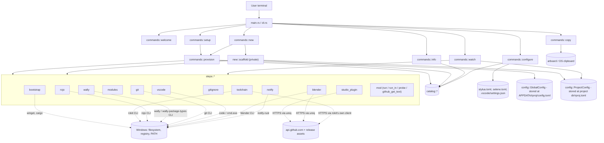
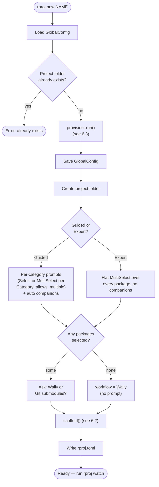
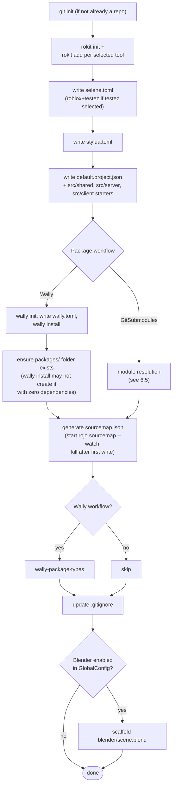
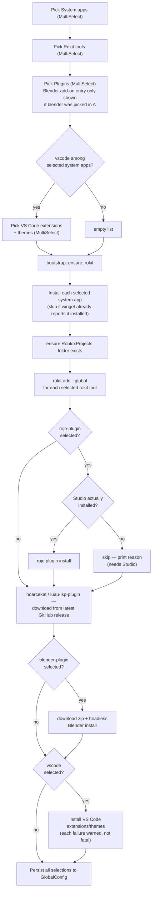
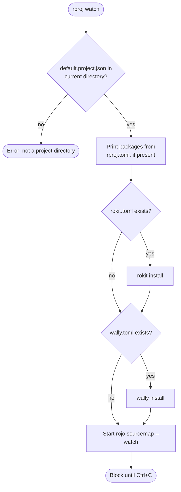

# rproj — Architecture

## 1. System Overview

`rproj` is a Rust command-line tool (crate name `rproj`, binary `rproj`) that takes a fresh Windows PC to a working Roblox game-development setup and scaffolds individual Roblox/Luau projects on top of it. It replaces manually installing and configuring Git, VS Code, Roblox Studio, the Roblox client, Blender, and the Rojo/Wally/Rokit/Selene/StyLua toolchain one at a time.

Every choice `rproj` presents — which system app, which CLI tool, which Studio plugin, which VS Code extension, which Roblox package — is shown with a plain-language description and a maintenance-status badge, so a newcomer is guided toward a working, professional setup without needing to already know the ecosystem, while an experienced developer can move through the same prompts quickly by picking exactly what they want.

`rproj new <name>` is the single, self-sufficient entry point: it asks what the machine still needs (installing/skipping each item idempotently), then walks through a project's package composition and package-management workflow, then scaffolds one Roblox project. `rproj setup` runs the same machine-provisioning step standalone, for pre-provisioning a machine without creating a project yet — it is optional, not a prerequisite. `rproj watch` resumes the dev loop for an existing project (installs anything missing, then starts Rojo's sourcemap watcher). `rproj copy` is a small clipboard utility that concatenates everything under `./src`. `rproj info [key]` is a catalog lookup/reference command.

This version is Windows-only (installs go through `winget`).

## 2. Behavior / Rules Specification

### 2.1 Commands

| Command | Behavior |
|---|---|
| `rproj` (no args) | Prints a welcome/intro screen listing every command with a one-line description. Does not touch the filesystem or network. |
| `rproj setup` | Runs machine provisioning only (see 2.2). Does not create a project. Safe to re-run any time to add or remove tools. |
| `rproj new <name>` | Runs machine provisioning inline, then project scaffolding (see 2.2, 2.3). Fails immediately if `<RobloxProjects>/<name>` already exists. |
| `rproj configure [key]` | Walks through one tool's settings, printing what each does before prompting, then writes them to that tool's config file relative to the current directory (see §8.4). With no key, prompts to pick a tool from the configurable list; with an unknown key, errors and lists the valid ones. |
| `rproj watch` | Must be run from inside an existing project directory (one containing `default.project.json`); otherwise errors. Syncs the project's own tools/packages, then starts and blocks on Rojo's sourcemap watcher until interrupted (Ctrl+C). |
| `rproj copy` | Recursively walks `./src`, concatenates every file's contents (each prefixed with a `// --- relative/path ---` header) and copies the result to the system clipboard. Prints a message and exits cleanly (not an error) if `src/` doesn't exist or contains no readable files. |
| `rproj info` (no key) | Prints a terse, categorized listing of the entire catalog: wally packages grouped by category (name/author/version only), tools grouped by family (name/provider/kind only). No descriptions or maintenance badges — intentionally compact. |
| `rproj info <key>` | Prints full detail for one catalog entry (wally package or tool): description, maintenance status, source/provider, docs link. Checks wally packages first, then tools; prints a "not found" message if `<key>` matches neither. |

### 2.2 Machine provisioning (shared by `rproj setup` and the inline step in `rproj new`)

Provisioning always asks, in this order:

1. **System apps** — multi-select (Git, VS Code, Roblox Studio, Roblox client, Blender).
2. **Rokit-managed CLI tools** — multi-select (Rojo, Wally, wally-package-types, Selene, StyLua, Lute, Tarmac, Mantle).
3. **Plugins** — multi-select, contextually filtered: every entry is shown *except* the Blender add-on, which only appears if "blender" was picked in step 1 during the same run.
4. **VS Code extensions & themes** — multi-select, only asked at all if "vscode" was picked in step 1.

Rules that hold regardless of which command triggered provisioning:

- Every picker defaults to the caller's *previous* selection (read from `GlobalConfig`) if one exists; otherwise it defaults to each catalog entry's own `default_selected` flag.
- Nothing already installed/present is ever reinstalled — every install path checks first (via `winget list`, a rokit-add idempotency check, `code --list-extensions`, a destination-file/folder existence check, or a Blender-internal module-name check, depending on the item).
- A single item failing to install is reported as a warning to the user and does **not** stop the rest of provisioning, nor the project scaffold that follows it (in `rproj new`).
- Rokit tools are registered in rokit's *global* manifest (not just a project's) before anything tries to invoke one of them outside a project directory — this is required for `rojo plugin install` to work during provisioning, since no project (and thus no project-local `rokit.toml`) necessarily exists yet.
- The Rojo Studio-plugin install is skipped (with an explanatory message, not attempted at all) if Roblox Studio isn't detected as installed.
- Provisioning always ends by persisting every resulting selection back into `GlobalConfig`.

### 2.3 Project scaffolding (`rproj new`, after provisioning)

1. Fails if the target project folder already exists (checked before provisioning even runs).
2. Package composition — choose one of:
   - **Guided walkthrough**: one prompt per category, in a fixed order (State management → UI → Data & profiles → Testing → Utilities). State management/UI/Data & profiles are single-pick with a "none" option (these are architecturally exclusive choices); Testing/Utilities are multi-pick (these are additive toolboxes).
   - **Expert checklist**: one flat multi-select across every package in the catalog, no categorization.
   - Guided-mode picks automatically add "companion" packages (see §8's companion table); expert mode does not — it expects the user to pick companions themselves from the full flat list.
3. Package workflow — choose **Wally** (default, and the only option silently applied if zero packages were selected) or **git submodules**. This choice is per-project and applies to every selected package uniformly (not mixed).
4. Scaffold, in a fixed order (see the Flow Diagrams section — the order here is a hard requirement, not a style choice; getting it wrong caused a real, reproduced bug — see Invariants & Landmines):
   - `git init` if the folder isn't already a repo.
   - `rokit init` + `rokit add` (project-local) for every globally-selected rokit tool.
   - Write `selene.toml` (`std = "roblox+testez"` if `testez` is among the selected packages, else `std = "roblox"`).
   - Write `stylua.toml`.
   - Write `default.project.json` from scratch with a conventional Server/Client/Shared tree, the place template's services and properties (§8.3), and matching `src/shared`, `src/server`, `src/client` starter files.
   - Install packages per the chosen workflow — Wally: `wally init` + write `wally.toml` + `wally install`, then ensure `packages/` exists regardless of whether `wally install` created it (it doesn't, with zero dependencies); git submodules: module resolution per §8.2/§6.5, which clones each repo once and generates the `modules/` tree.
   - Generate an initial `sourcemap.json` (briefly starts and kills `rojo sourcemap --watch`).
   - Run `wally-package-types` (Wally workflow only).
   - Update `.gitignore`.
   - Scaffold a Blender starter scene if Blender was enabled during provisioning.
5. Write `rproj.toml` recording the composition mode, package workflow, resulting package list, and which tool keys were active at creation time.

## 3. Data Model / State Shape

Two persisted files, both TOML, both `serde`-derived:

```rust
// %APPDATA%\rproj\config.toml (directories::ProjectDirs::from("", "", "rproj").config_dir())
// Machine-wide. Read/written by every `rproj setup` and `rproj new` run.
struct GlobalConfig {
    roblox_projects_root: Option<PathBuf>,     // defaults to <Documents>/RobloxProjects if None
    selected_system_apps: Vec<String>,          // catalog keys, e.g. ["git", "vscode", "studio"]
    selected_rokit_tools: Vec<String>,
    selected_studio_plugins: Vec<String>,       // includes "blender-plugin" if picked, despite the field name
    selected_vscode_extensions: Vec<String>,
    last_checked: Option<String>,               // unix timestamp as a string, informational only
}

// <project_dir>/rproj.toml
// Written once by `rproj new`; read (packages list only) by `rproj watch`.
struct ProjectConfig {
    mode: String,                    // "guided" | "expert"
    package_workflow: PackageWorkflow,
    packages: Vec<String>,           // catalog keys, including auto-added companions
    tools_at_creation: Vec<String>,  // snapshot of GlobalConfig.selected_rokit_tools at creation time
}

#[serde(rename_all = "kebab-case")]  // serializes as "wally" | "git-submodules"
enum PackageWorkflow {
    Wally,
    GitSubmodules,
}
```

Static, in-memory-only catalog data (not persisted, compiled into the binary as `const` slices):

```rust
enum Maintenance { Active, CommunityStable, Legacy }
impl Maintenance {
    fn badge(&self) -> &'static str;       // full text, used by `rproj info <key>`
    fn short_badge(&self) -> &'static str; // one word, used inline in pickers
}

enum ToolKind {
    SystemApp { winget_id: &'static str },
    RokitTool { rokit_source: &'static str },
    VsCodeExtension { extension_id: &'static str },
    StudioPlugin { github_repo: &'static str, asset_suffix: &'static str },
    BlenderAddon { github_repo: &'static str },
}

struct ToolEntry {
    key: &'static str,
    description: &'static str,
    maintenance: Maintenance,
    kind: ToolKind,
    family: &'static str,        // groups counterparts across mechanisms, e.g. "Rojo" = CLI + Studio plugin + VS Code ext
    default_selected: bool,
    docs_url: &'static str,
}

enum Category { StateManagement, Ui, DataProfile, Testing, Utility }
impl Category {
    fn allows_multiple(&self) -> bool; // true only for Testing, Utility
}

struct Submodule {
    dir: &'static str,           // folder under modules/submodules/; shared by packages from one repo
    path: &'static str,          // requirable source within dir, e.g. "packages/charm/src"
}

struct PackageSpec {
    key: &'static str,
    source: &'static str,        // Wally coordinate, e.g. "littensy/reflex@4.3.1"
    git_repo: &'static str,      // clone URL for the git-submodule workflow
    module_name: &'static str,   // instance + link-file name; load-bearing, see §8.2
    submodule: Option<Submodule>,// None = can't be vendored as a raw submodule (needs an npm/pnpm install upstream)
    description: &'static str,
    maintenance: Maintenance,
    category: Category,
    docs_url: &'static str,
    primary_choice: bool,        // false = companion-only, never shown standalone in guided mode
}

// Place template (§8.3) — what every scaffolded project's DataModel starts with
enum PropValue { Number(f64), Color(u8, u8, u8) }   // Color authored 0-255, rendered as Rojo 0-1 floats
struct PropertySpec { name: &'static str, value: PropValue }
struct InstanceSpec {
    name: &'static str,
    class_name: &'static str,
    parent: Option<&'static str>, // None = service under the DataModel
    properties: &'static [PropertySpec],
}

// Tool settings (§8.4) — what `rproj configure` walks through
struct ChoiceOption { value: &'static str, explanation: &'static str }
enum SettingKind {
    Bool { default: bool },
    Integer { default: i64 },
    Choice { default: &'static str, options: &'static [ChoiceOption] },
}
struct SettingSpec {
    key: &'static str,
    description: &'static str,
    section: Option<&'static str>, // TOML table this key belongs under; None = top level
    kind: SettingKind,
}
enum ConfigTarget {
    ProjectToml { filename: &'static str },
    VsCodeSettings,               // merged into .vscode/settings.json, never overwritten
}
struct ConfigurableTool {
    key: &'static str,            // matches the tool catalog key
    display_name: &'static str,
    summary: &'static str,
    target: ConfigTarget,
    docs_url: &'static str,
    settings: &'static [SettingSpec],
}
```

## 4. File / Module Structure

```
rproj/
├── Cargo.toml
├── Cargo.lock
├── .gitignore
├── docs/
│   └── architecture.md          this document
└── src/
    ├── main.rs                  clap dispatch to commands::*
    ├── cli.rs                   clap derive: Cli, Command (Setup | New{name} | Configure{key} | Watch | Copy | Info{key})
    ├── config.rs                GlobalConfig, PackageWorkflow, ProjectConfig
    ├── catalog/
    │   ├── mod.rs               Maintenance enum
    │   ├── tool_catalog.rs      ToolKind, ToolEntry, FAMILY_ORDER, SYSTEM_APPS, ROKIT_TOOLS, PLUGINS, VSCODE_EXTENSIONS
    │   ├── place_template.rs    PropValue, PropertySpec, InstanceSpec, PLACE_TEMPLATE, render()  [+ 3 tests]
    │   ├── tool_settings.rs     SettingKind, SettingSpec, ConfigTarget, ConfigurableTool, CONFIGURABLE_TOOLS
    │   └── wally_packages.rs    Category, Submodule, PackageSpec, PACKAGES, companions_for()
    ├── commands/
    │   ├── mod.rs               module declarations only
    │   ├── welcome.rs           bare `rproj` intro screen
    │   ├── setup.rs             `rproj setup` — thin wrapper around provision::run
    │   ├── provision.rs         shared picker+installer for system apps/rokit tools/plugins/vscode ext
    │   ├── new.rs               `rproj new <name>` — package composition + project scaffold
    │   ├── configure.rs         `rproj configure [tool]` — prompts from tool_settings, writes config files
    │   ├── watch.rs             `rproj watch` — resume dev loop
    │   ├── copy.rs              `rproj copy` — clipboard utility
    │   └── info.rs              `rproj info [key]` — catalog lookup
    └── steps/
        ├── mod.rs               run / run_in / probe / github_get_text — shared process + HTTP helpers
        ├── bootstrap.rs         winget install/detect, rokit self-install, RobloxProjects folder creation
        ├── toolchain.rs         rokit init/add (project-local and --global), selene.toml/stylua.toml
        ├── rojo.rs              default.project.json scaffold, `rojo plugin install`, sourcemap watcher
        ├── modules.rs           modules/ tree for the submodule workflow: submodules project + link files  [+ 5 tests]
        ├── wally.rs             wally init/install, wally.toml generation from selected packages
        ├── git.rs               git init, git submodule add
        ├── gitignore.rs         .gitignore entries
        ├── vscode.rs            VS Code CLI location (PATH + winget-install fallback), extension install
        ├── studio_plugin.rs     generic "download latest GitHub release asset → Studio Plugins folder"
        ├── blender.rs           Blender add-on install (headless Python), starter-scene scaffold
        └── notify.rs            desktop toast notification wrapper
```

28 source files. Tests live inline in `#[cfg(test)]` modules beside the code they cover — see §9.

## 5. Subsystem Map



`catalog::*` is pure, static, read-only data with no side effects. `steps::*` is where every side-effecting operation (process spawns, filesystem writes, HTTP calls) lives. `commands::*` is orchestration only — it reads the catalog, drives `inquire` prompts, and calls into `steps::*` in a specific order; it does not itself spawn processes or make HTTP calls (`provision.rs` and `new.rs` are the two files that do the most orchestration, and are correspondingly the largest).

## 6. Flow Diagrams

### 6.1 `rproj new <name>` — top-level flow



### 6.2 `scaffold()` — internal ordering

This ordering is a hard requirement, not a style preference — see the "sourcemap/folder ordering" entry in §7.



### 6.3 Machine provisioning (`provision::run`)



Every install step in this flow that can fail per-item (system app install, rokit global add, each plugin, each VS Code extension) is implemented to warn and continue rather than propagate — a single flaky installer never aborts the rest of the run.

### 6.4 `rproj watch`



### 6.5 Module resolution (git-submodule workflow)

From a package selection to something project code can `require`. See §8.2 for the data contract each step reads.


## 7. Invariants & Landmines

Each of these was learned from an actual reproduced failure during this project's development, not theorized in advance.

- **Roblox Studio's winget package has a known, recurring, external hash-mismatch bug.** `winget install --id Roblox.RobloxStudio` can fail with "Installer hash does not match" because Roblox's installer self-updates behind a static download URL faster than the winget-pkgs manifest's pinned hash gets refreshed. This is an upstream winget-pkgs issue, not something `rproj` can fix — `bootstrap::install_winget` detects this specific message and surfaces an explanatory, non-fatal warning instead of a bare error.
- **A winget-installed app is often not on PATH within the same shell session that installed it**, even though the installer registers it in the registry-level PATH for future sessions. This hit both Blender (`blender.exe`) and VS Code (`code`/`code.cmd`) — both `steps::blender::locate_blender_exe` and `steps::vscode::locate_code` probe PATH first, then fall back to scanning the known winget install location (`Program Files\Blender Foundation\*\blender.exe`, `%LocalAppData%\Programs\Microsoft VS Code\bin\code.cmd`) before giving up.
- **`code.cmd` is a batch file; Rust's `Command::new` cannot execute it directly on Windows** (Rust does not implicitly wrap `.bat`/`.cmd` targets in `cmd.exe`). Any invocation that resolves to the fallback path must be run as `cmd.exe /C <path> <args...>` — see `steps::vscode::run_code`.
- **`rokit add --global <tool>` errors instead of silently no-op'ing when the tool is already in the global manifest** ("Tool already exists and can't be added"), unlike a project-local `rokit add`, which is idempotent. `steps::toolchain::run_rokit_add` detects this specific message and treats it as success.
- **Rokit resolves tools by walking up the directory tree looking for a `rokit.toml`**, with `~/.rokit/rokit.toml` (`rokit add --global`) as the machine-wide fallback. Any tool invocation that happens outside a project directory (e.g. `rojo plugin install` during provisioning, before any project exists) needs the tool registered *globally* first — a project-local `rokit add` alone does not make the tool resolvable from an arbitrary working directory.
- **GitHub's unauthenticated REST API rate limit is 60 requests/hour per IP**, and it is shared across every GitHub-touching call `rproj` makes *and* every call rokit itself makes internally (e.g. for each `rokit add`). This is easy to exhaust during rapid iterative testing — surfaced as `ureq::Error::StatusCode(403)` in `rproj`'s own calls (`steps::github_get_text`) and as literal `"403 Forbidden"`/"rate limit" text in rokit's own CLI output (`steps::toolchain::run_rokit_add`). Both are detected and explained rather than left as a bare status code.
- **Every real wally-catalog package's GitHub repo ships its own `default.project.json`**, and Rojo auto-detects *any* `default.project.json` inside a `$path`-included folder tree, substituting it as a nested project definition. Several of those vendored project files declare `$path`s into `node_modules/...` for their own monorepo test harness (`littensy/charm`, `littensy/ripple`), which only exist after an `npm`/`pnpm` install that never runs here — a hard sync error, not an incomplete sync. Two things that do **not** fix this, both empirically disproven rather than theorized: `globIgnorePaths` does not suppress nested-project auto-detection (it only filters plain files), and naming the mounted instances after catalog keys breaks the packages' own cross-requires. The mechanism that does work is §8.2 — never let Rojo see a vendored repo's root at all.
- **The instance names under `modules/submodules` are behaviour, not cosmetics.** The monorepo packages cross-require each other by *sibling name* through Luau's require-by-string: `charm-sync/src/client.luau` does `require("../Charm")` and `vide-charm/src/init.luau` does `require("./Charm")` (for an `init.luau`, `./` resolves to the module's own parent, so both land on a sibling of the mounted package). Those resolve only because the sibling is mounted as exactly `Charm`. Renaming these mounts to catalog keys (`charm`, `charmSync`) would leave the packages requiring instances that don't exist — a runtime nil, not a build error, so nothing would catch it before Studio. Locked down by `steps::modules::tests::monorepo_siblings_are_mounted_under_the_names_they_require`.
- **Diffing a folder's contents before/after an operation to discover an identity only works the first time.** The Blender add-on install originally discovered its own module name by diffing Blender's addons folder before/after `addon_install()` — this silently stopped working the moment the addon already existed on disk (including from before the idempotency check existed at all), since there was never anything "new" left to diff. Fixed by reading the module name directly from the source of truth (the downloaded zip's own top-level entry, via Python's `zipfile`) instead of inferring it from a filesystem-state comparison.
- **Blender is a Windows GUI-subsystem executable; its console output does not reliably flow through Rust's inherited-stdio `Command::status()`.** A failure could previously report "see output above" with nothing actually above it. `steps::blender::run_headless_script` uses `Command::output()` to capture stdout/stderr explicitly and always prints them, regardless of success/failure.
- **`inquire::MultiSelect` has no default "enter to confirm" help text** (confirmed by reading the crate source directly) — only `Select` does. Every `MultiSelect` call site sets `.with_help_message(...)` explicitly to include it.
- **`inquire`'s default post-answer formatter echoes back every selected option's full label text**, joined together — unreadable once option labels carry a description and badge (which every picker's labels do). Every `Select`/`MultiSelect` call site over such labels sets a custom `.with_formatter(...)` that prints just the key(s).
- **A catalog `key` is not the same value as the underlying install identifier** (winget id, rokit source, VS Code extension id, GitHub repo). Conflating the two once meant passing catalog keys straight to `code --install-extension`, which silently failed every single extension (each reported "not found" individually rather than crashing outright, which is part of why it went unnoticed until the whole batch was inspected). Anywhere an install step needs the underlying identifier, it must look it up from the matching `ToolEntry`/`PackageSpec`'s `kind`/`source`/`git_repo` field, never assume the catalog key doubles as it.
- **A single item's failure inside a loop over multiple items must never propagate with a bare `?`.** Every install loop in this codebase (system apps, rokit tools — both global and per-project, Studio plugins, Blender add-on, VS Code extensions) is written to catch, warn, and continue per item, specifically because an early version that didn't do this let one flaky item (a rate-limited GitHub call, a winget hash mismatch) abort everything downstream, including the entire project scaffold.
- **Wally's lockfile (`wally.lock`) should be committed, not gitignored** — the same convention as `Cargo.lock`, for reproducible installs across a team. An earlier version of `steps::gitignore` had this backwards.
- **`rojo sourcemap --watch` requires its `$path` target folder to already exist on disk** — attempting to generate a sourcemap before the package-install step has created `packages/`/`modules/` fails outright ("could not be turned into a Roblox Instance"), not just incompletely. Package installation (and an explicit `create_dir_all` safety net, since `wally install` may not create `packages/` at all with zero dependencies) must run before sourcemap generation, never after.

## 8. Data-Driven Matrices

### 8.1 `ToolKind` → mechanism

Adding a new tool/plugin/extension to the catalog never requires touching `steps::*` logic — only a new `ToolEntry` constant. The mechanism is entirely determined by which `ToolKind` variant it uses:

| `ToolKind` variant | Install mechanism | Detection mechanism | Implemented in |
|---|---|---|---|
| `SystemApp { winget_id }` | `winget install --id <id> -e --accept-source-agreements --accept-package-agreements` | `winget list --id <id> -e` | `steps::bootstrap` |
| `RokitTool { rokit_source }` | `rokit add [--global] <source>` | rokit's own idempotency (project-local: silent no-op; global: "already exists" error, treated as success) | `steps::toolchain` |
| `VsCodeExtension { extension_id }` | `code --install-extension <id>` (or via `cmd.exe /C` if `code` resolves to the fallback `.cmd` path) | `code --list-extensions` | `steps::vscode` |
| `StudioPlugin { github_repo, asset_suffix }` | Rojo's own plugin (`rojo-rbx/rojo`, empty `asset_suffix`): `rojo plugin install`. All others: download the latest GitHub release asset whose filename ends with `asset_suffix`, copy into `%LOCALAPPDATA%\Roblox\Plugins`. | Destination filename existence (or `rojo plugin install`'s own idempotency for Rojo's plugin) | `steps::rojo` (Rojo's own plugin), `steps::studio_plugin` (everything else) |
| `BlenderAddon { github_repo }` | Download latest `.zip` release asset, install via headless `blender --background --python <script>` calling `bpy.ops.preferences.addon_install`/`addon_enable` | Module name (read from the zip's own top-level entry) checked against Blender's addons folder | `steps::blender` |

### 8.2 Module resolution (data-driven)

How a selected package becomes something project code can `require`, under the git-submodule workflow. Replaces an earlier approach where `steps::rojo` hand-built one `Modules.<key>` entry per package in code.

Three artifacts are generated, and the layout matches littensy/fishing-minigame, a real project consuming several of these same packages this way:

```text
modules/
  Charm.luau                  generated link:  return require(script.Parent.submodules.Charm)
  Vide.luau
  submodules/
    default.project.json      generated; maps each cloned repo's real source
    charm/                    git submodule (the whole upstream repo)
    vide/
```

The root project maps `modules → $path: "modules"` wholesale. Rojo auto-detects `modules/submodules/default.project.json` and uses it for the `submodules` folder — and because that file only ever `$path`s *into* specific source subfolders, Rojo never walks a vendored repo's root, so it never sees the vendored project file that would otherwise break the sync.

**Requirement matrix** — what each field of a `PackageSpec` has to satisfy for the package to resolve:

| Requirement | Field | Why it must hold | Enforced by |
|---|---|---|---|
| Mount path reaches inside the repo, never its root | `submodule.path` | A repo root lets Rojo load the vendored `default.project.json` as a nested project and fail on its `node_modules` paths | `tests::never_maps_a_vendored_repo_root` |
| Mount name matches what dependents require | `module_name` | Monorepo packages cross-require siblings by name (`require("../Charm")`); a mismatch is a silent runtime nil | `tests::monorepo_siblings_are_mounted_under_the_names_they_require` |
| Link file requires the name the package is mounted under | `module_name` | The link is the only path project code uses; a mismatch resolves to nil | `tests::link_files_require_the_name_the_package_is_mounted_under` |
| Packages sharing a repo share one clone | `submodule.dir` | `git submodule add` fails on a path that already exists | `tests::monorepo_packages_share_one_submodule_dir` |
| Packages needing an npm/pnpm install never reach the project file | `submodule: None` | A bare git clone can't resolve `require("@pkg/...")` aliases | `tests::excludes_packages_that_cannot_be_vendored` |

**Resolver mapping** — how one catalog entry expands into paths and instances (`dir`/`path` from `Submodule`, `N` = `module_name`):

| Artifact | Derived as | Example (`charmSync`) |
|---|---|---|
| Clone location on disk | `modules/submodules/{dir}` | `modules/submodules/charm` |
| Entry in submodules project | `"{N}": { "$path": "./{dir}/{path}" }` | `"CharmSync": { "$path": "./charm/packages/charm-sync/src" }` |
| Generated link file | `modules/{N}.luau` | `modules/CharmSync.luau` |
| Link file body | `return require(script.Parent.submodules.{N})` | `return require(script.Parent.submodules.CharmSync)` |
| Instance path in Studio (package) | `ReplicatedStorage.modules.submodules.{N}` | `…submodules.CharmSync` |
| Instance path in Studio (link) | `ReplicatedStorage.modules.{N}` | `…modules.CharmSync` |

**The rule this system guarantees: adding a new vendorable package requires only a `PackageSpec` entry — no code changes.** `steps::modules` reads the catalog and derives every path, instance name, and file above; nothing in it names a specific package.

Packages with `submodule: None` are the deliberate exception: they cannot be vendored as raw submodules at all, so `commands::new::pick_package_workflow` detects them in the current selection and falls back to Wally with an explanatory note rather than offering a choice that would break.

### 8.3 Place template (data-driven)

`catalog::place_template::PLACE_TEMPLATE` is a table of instances and properties baked into every scaffolded `default.project.json`, so new projects open with the intended look instead of Studio's defaults. Colours are authored as 0–255 components (what Studio's colour picker shows) and converted to the 0–1 floats Rojo's format expects at render time.

| Instance | Class | Parent | Properties |
|---|---|---|---|
| `Lighting` | `Lighting` | *(service)* | Ambient `200,160,225`; Brightness `2.5`; ColorShift_Bottom `0,0,0`; ColorShift_Top `214,189,135`; EnvironmentDiffuseScale `0.5`; EnvironmentSpecularScale `1`; OutdoorAmbient `124,100,149`; FogColor `200,170,249`; FogEnd `2500`; FogStart `0` |
| `ColorCorrection` | `ColorCorrectionEffect` | `Lighting` | Brightness `0.05`; Contrast `0.1`; Saturation `0.15`; TintColor `255,255,255` |

**Adding a service, child instance, or property to every new project requires only a `PLACE_TEMPLATE` entry — no code changes.** `steps::rojo` renders whatever is in the table.

### 8.4 Tool settings (data-driven)

`catalog::tool_settings::CONFIGURABLE_TOOLS` backs `rproj configure`. Each setting carries its own explanation, accepted values, and what each value means; `commands::configure` renders prompts from the table and knows nothing about any specific tool.

| Tool key | Written to | Settings covered |
|---|---|---|
| `stylua` | `stylua.toml` | syntax, column_width, indent_type, indent_width, quote_style, call_parentheses, collapse_simple_statement, line_endings, `[sort_requires] enabled` |
| `selene` | `selene.toml` | `std`, plus `[rules]` levels for undefined_variable, unused_variable, shadowing, global_usage, incorrect_standard_library_use, mixed_table, multiple_statements, roblox_incorrect_roact_usage |
| `luau-lsp` | `.vscode/settings.json` | sourcemap enable/autogenerate/project file, types.roblox, platform.type, completion (autocompleteEnd, imports), inlay hints, diagnostics, plugin.enabled |
| `stylua-vscode` | `.vscode/settings.json` | editor.formatOnSave, stylua.searchParentDirectories |

| `ConfigTarget` | Write behaviour |
|---|---|
| `ProjectToml { filename }` | Rewritten from the answers; top-level keys emitted before any `[table]` header, since in TOML every key after a header belongs to that table |
| `VsCodeSettings` | **Merged** into `.vscode/settings.json`, never overwritten — the file holds unrelated editor preferences and more than one catalog tool writes to it. Refuses rather than silently discarding content if the existing file has comments or trailing commas (legal for VS Code, not for `serde_json`) |

Option names and accepted values are taken from each tool's own upstream documentation (StyLua's README options table, Selene's lint docs, the luau-lsp extension's own `package.json` contributions), not from memory.

**Adding a setting, or a whole new configurable tool, requires only a data entry — no code changes.**

### 8.5 Catalog contents

**System apps** (`SYSTEM_APPS`, all family `"System apps"`):

| key | winget_id | maintenance | default_selected |
|---|---|---|---|
| git | Git.Git | Active | true |
| vscode | Microsoft.VisualStudioCode | Active | true |
| studio | Roblox.RobloxStudio | Active | true |
| roblox | Roblox.Roblox | Active | true |
| blender | BlenderFoundation.Blender | Active | false |

**Rokit tools** (`ROKIT_TOOLS`):

| key | rokit_source | family | maintenance | default_selected |
|---|---|---|---|---|
| rojo | rojo | Rojo | Active | true |
| wally | wally | Wally | Active | true |
| wally-package-types | wally-package-types | Wally | Active | true |
| selene | selene | Selene | Active | true |
| stylua | JohnnyMorganz/StyLua | StyLua | Active | true |
| lute | luau-lang/lute | Lute | Active | true |
| tarmac | Roblox/tarmac | Tarmac | Active | false |
| mantle | blake-mealey/mantle | Mantle | **Legacy** (unmaintained upstream — kept with an honest badge, not excluded) | false |

**Plugins** (`PLUGINS`):

| key | kind | github_repo | asset_suffix | family | default_selected | contextual? |
|---|---|---|---|---|---|---|
| rojo-plugin | StudioPlugin | rojo-rbx/rojo | (n/a — via `rojo plugin install`) | Rojo | true | no |
| hoarcekat | StudioPlugin | Kampfkarren/hoarcekat | .rbxm | Testing & extras | false | no |
| luau-lsp-plugin | StudioPlugin | JohnnyMorganz/luau-lsp | .rbxm | Luau Language Server | true | no |
| blender-plugin | BlenderAddon | Roblox/roblox-blender-plugin | (`.zip`) | Blender | true | **yes** — hidden unless "blender" is among the selected system apps |

**VS Code extensions & themes** (`VSCODE_EXTENSIONS`):

| key | extension_id | family | maintenance | default_selected |
|---|---|---|---|---|
| luau-lsp | JohnnyMorganz.luau-lsp | Luau Language Server | Active | true |
| vscode-rojo | evaera.vscode-rojo | Rojo | CommunityStable (unmaintained since 2022, still functions) | true |
| selene-vscode | Kampfkarren.selene-vscode | Selene | Active | true |
| stylua-vscode | JohnnyMorganz.stylua | StyLua | Active | true |
| theme-one-dark | akamud.vscode-theme-onedark | Themes | Active | false |
| theme-monospace | keksiqc.idx-monospace-theme | Themes | Active | false |
| theme-horizon | alexandernanberg.horizon-theme-vscode | Themes | Active | false |

**Wally packages** (`PACKAGES`, grouped by `Category`):

`module_name` is the instance the package is mounted as and the name of its generated link file; `submodule` is the clone dir and the verified real-source subpath within it. A `—` in the submodule column means the package can't be vendored as a raw git submodule at all, so `pick_package_workflow` forces Wally when one is selected. See §8.2 for how these expand into paths and instances.

*UI:*

| key | source | git_repo | module_name | submodule (dir / path) | maintenance | primary_choice |
| --- | --- | --- | --- | --- | --- | --- |
| react | jsdotlua/react@17.2.1 | jsdotlua/react-lua | React | — (needs npm/pnpm) | Active | true |
| reactRoblox | jsdotlua/react-roblox@17.2.1 | jsdotlua/react-lua | ReactRoblox | — (needs npm/pnpm) | Active | false (companion of react) |
| vide | centau/vide@0.4.1 | centau/vide | Vide | vide / src | Active | true |
| fusion | elttob/fusion@0.3.0 | dphfox/Fusion | Fusion | fusion / src | Active | true |

*State management:*

| key | source | git_repo | module_name | submodule (dir / path) | maintenance | primary_choice |
| --- | --- | --- | --- | --- | --- | --- |
| reflex | littensy/reflex@4.3.1 | littensy/reflex | Reflex | reflex / src | Active | true |
| reactReflex | littensy/react-reflex@0.3.6 | littensy/react-reflex | ReactReflex | react-reflex / src | Active | false (companion) |
| charm | littensy/charm@0.11.0 | littensy/charm | Charm | charm / packages/charm/src | Active | true |
| charmSync | littensy/charm-sync@0.4.0 | littensy/charm | CharmSync | charm / packages/charm-sync/src | Active | false (companion) |
| reactCharm | littensy/react-charm@0.4.0 | littensy/charm | ReactCharm | — (needs react) | Active | false (companion) |
| videCharm | littensy/vide-charm@0.4.0 | littensy/charm | VideCharm | charm / packages/vide-charm/src | Active | false (companion) |

*Data & profiles:*

| key | source | git_repo | module_name | submodule (dir / path) | maintenance | primary_choice |
| --- | --- | --- | --- | --- | --- | --- |
| lyra | paradoxum-games/lyra@0.6.0 | paradoxum-games/lyra | Lyra | lyra / src | Active | true |
| profilestore | lm-loleris/profilestore@1.0.3 | MadStudioRoblox/ProfileStore | ProfileStore | profilestore / ProfileStore.luau | Active | true |

*Testing:*

| key | source | git_repo | module_name | submodule (dir / path) | maintenance | primary_choice |
| --- | --- | --- | --- | --- | --- | --- |
| testez | roblox/testez@0.4.1 | Roblox/testez | TestEZ | testez / src | **Legacy** (archived by Roblox Sept 2024; still the most common Wally-installable test framework in existing projects) | true |

*Utilities:*

| key | source | git_repo | module_name | submodule (dir / path) | maintenance | primary_choice |
| --- | --- | --- | --- | --- | --- | --- |
| janitor | howmanysmall/janitor@1.18.3 | howmanysmall/Janitor | Janitor | janitor / src | Active | true |
| ripple | littensy/ripple@0.10.2 | littensy/ripple | Ripple | ripple / packages/ripple/src | Active | true |
| reactRipple | littensy/react-ripple@3.0.1 | littensy/ripple | ReactRipple | — (needs react) | Active | false (companion) |
| videRipple | littensy/vide-ripple@0.10.2 | littensy/ripple | VideRipple | ripple / packages/vide-ripple/src | Active | false (companion) |
| remo | littensy/remo@1.5.3 | littensy/remo | Remo | remo / src | Active | true |
| promise | evaera/promise@4.0.0 | evaera/roblox-lua-promise | Promise | promise / lib | CommunityStable | true |
| greentea | corecii/greentea@0.4.11 | corecii/greentea | gt | greentea / src | CommunityStable | true |
| t | osyrisrblx/t@3.1.1 | osyrisrblx/t | t | t / lib | CommunityStable | true |
| sift | csqrl/sift@0.0.11 | csqrl/sift | Sift | sift / src | CommunityStable (no longer actively maintained upstream, not archived) | true |

### 8.6 Companion rules (`companions_for`)

Guided mode applies these automatically after the category prompts finish; expert mode does not (it shows every entry individually).

| Primary key picked | Condition | Companion(s) added |
|---|---|---|
| react | (always) | reactRoblox |
| reflex | selection already contains `react` | reactReflex |
| charm | (always) | charmSync |
| charm | selection contains `react` | + reactCharm |
| charm | selection contains `vide` (and not `react`) | + videCharm |
| ripple | selection contains `react` | reactRipple |
| ripple | selection contains `vide` | videRipple |

## 9. Testing Strategy

8 automated tests exist, all inline `#[cfg(test)]` unit tests run by `cargo test`. There is no CI configuration and `Cargo.toml` declares no dev-dependencies (nothing beyond `std` assertions is needed).

| Test file | Covers |
| --- | --- |
| `src/steps/modules.rs` (5 tests) | Every row of §8.2's requirement matrix: no mapped path is a repo root; monorepo siblings are mounted under the names their own source requires; unvendorable packages are excluded; link files require the name the package is mounted under; packages sharing a repo share one clone dir. |
| `src/catalog/place_template.rs` (3 tests) | Studio 0–255 colours convert to Rojo's 0–1 floats and stay in range; child instances nest under their declared parent rather than leaking to top level; every declared parent actually exists in the table (otherwise `render` silently drops the child). |

These deliberately encode §7's landmines rather than the happy path — each one fails loudly if a specific past bug is reintroduced, including two failure modes (a wrong mount name, a dropped child) that would otherwise surface only as a runtime nil inside Studio, with no build error anywhere.

**Gaps, honestly:**

- **No test covers `commands::configure`** — neither the TOML writer's table ordering nor the `.vscode/settings.json` merge/refuse-on-unparseable behaviour. Both are described in §8.4 and both are currently only manually verified.
- **No test covers any step that shells out** (`winget`, `rokit`, `git`, `rojo`, `code`, `blender`) or touches the network. Every bug in §7 that involved one of those was found by a live manual run, and would be again.
- **Nothing exercises the interactive pickers**; all prompt flows are manual-only.
- **The end-to-end claim in §8.2 is not automated.** It was verified by cloning all six underlying repos and running both `rojo sourcemap` and `rojo build` against a tree generated by the real code path, confirming each package appears twice in the sourcemap (once as `modules.<Name>`, once as `modules.submodules.<Name>`) and that Lighting properties serialize with correct types. That check requires network and a real `rojo` binary, so it is a manual procedure, not a test.

Alongside those: `cargo build` and `cargo clippy --all-targets -- -D warnings` are kept clean after every change.

## 10. Dependencies

| Crate | Used for | Why (where inferable) |
|---|---|---|
| `clap` (derive) | CLI argument/subcommand parsing (`cli.rs`) | Standard, derive-based, minimal boilerplate for a small fixed command set. |
| `inquire` | Interactive `Select`/`MultiSelect` prompts throughout `commands::provision` and `commands::new` | Provides arrow-key list prompts with defaults, help text, and custom answer formatters out of the box. |
| `serde` (derive), `toml` | `GlobalConfig`/`ProjectConfig` (de)serialization | TOML chosen for both config files to match the Rust/Rokit/Wally ecosystem's own convention (`Cargo.toml`, `rokit.toml`, `wally.toml`). |
| `serde_json` | `default.project.json` construction (`steps::rojo`) | Rojo's project format is JSON; `serde_json::Map` + `json!` builds it directly rather than via string templating, avoiding malformed-JSON risk from raw interpolation. |
| `anyhow` | Error handling with `.context(...)`/`with_context(...)` throughout | Chosen explicitly over silently swallowing errors (the old JS scripts this tool replaced called `process.exit(1)` on failure) — every failure carries a human-readable chain of context instead. |
| `arboard` | Cross-platform clipboard access (`commands::copy`) | Fixes a Windows-only/broken `clip` shell-out that a prior implementation used. |
| `walkdir` | Recursive directory walk (`commands::copy`) | Simple recursive file iteration for the `src/` concatenation. |
| `directories` | Cross-platform config-directory resolution (`config::GlobalConfig::dirs`) | Resolves `%APPDATA%\rproj` correctly without hardcoding a Windows-specific path. |
| `notify-rust` | Desktop toast notification after `rproj setup` completes | Simple one-call desktop notification; failures are logged, not propagated (a missing notification backend shouldn't fail the command). |
| `ureq` | Blocking HTTP client for GitHub API calls and asset downloads (`steps::studio_plugin`, `steps::blender`, `steps::github_get_text`) | Chosen over `reqwest` specifically to avoid pulling in an async runtime for a handful of one-shot blocking HTTP calls. |

## 11. Migration / Manual-Task Checklist

No code-level migrations are pending for the tool itself. The following are outstanding *manual verification* tasks — implemented and reasoned through available documentation/references, but not yet empirically confirmed against live tooling in this development environment:

- [ ] Confirm a full `rproj new <name>` run completes with zero warnings once GitHub's unauthenticated rate limit window has reset (this repository's own development involved enough rapid repeat testing to exhaust it repeatedly).
- [ ] `rproj watch`, run against a project scaffolded by this version of `rproj new`, has not yet been manually re-verified after the `default.project.json`/sourcemap-ordering changes in §7.
- [ ] `rproj configure` has been exercised only on its non-interactive paths (unknown-key error, `--help`, `rproj info` cross-link). The prompt flows themselves, and both `ConfigTarget` writers, have not been run end-to-end — see §9's gap list.

**Projects scaffolded by an earlier version of `rproj` need a one-time manual migration**, because the git-submodule layout changed shape (§8.2). There is no automated upgrade path; a project created before this change has capitalised `Modules/`, per-package `Modules.<key>.src` entries in its root project file, and no link files. Either re-scaffold it, or by hand: rename `Modules/` → `modules/`, move each submodule to `modules/submodules/<dir>` (updating `.gitmodules` paths), add `modules/submodules/default.project.json`, replace the root project's `Modules` block with `"modules": { "$path": "modules" }`, and add the `modules/<ModuleName>.luau` link files.

Runtime instructions the tool itself prints to the user (e.g. Blender's one-time "Install Dependencies" + Roblox-account-link step) are per-installation manual steps handled by `rproj`'s own output, not repository migration tasks, and are not tracked here.
