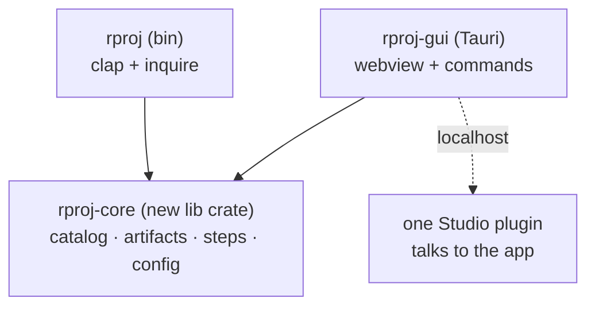

# rproj — plan

Working document. `docs/architecture.md` describes what exists; this describes what comes next and why.

Current: **v0.2.3**, 121 tests, Windows-only, Luau + Wally.

---

## 1. What rproj is, and what it is not

The scope boundary decides most arguments downstream, so it goes first.

**rproj is an orchestrator with an opinion.** It knows which tools exist, which are worth using in 2026, how they must be configured to agree with each other, and what breaks when they do not. It installs them, configures them, and scaffolds projects that already work.

**rproj is not a reimplementation of the toolchain.** It does not replace Rojo, Wally, Selene or StyLua.

That second line is a deliberate rejection of an appealing idea — one binary that *is* the whole toolchain — and the reason is not effort. It is that `default.project.json`, `wally.toml`, `wally.lock` and `.rbxm` are **interoperability contracts**. A project rproj creates has to open in a teammate's real Rojo. Diverge by one percent and the ecosystem forks and rproj's users are the ones stranded. When Roblox changes Studio's plugin API or a binary format, Rojo tracks it with a community; a fork would track it alone.

The unified experience that idea was reaching for is achievable without it — see §7.

### Non-goals

| | |
| --- | --- |
| macOS / Linux | Dropped, not deferred. |
| roblox-ts | Dropped, not deferred. |
| Replacing the toolchain | §1 above. |
| A package registry | Wally is the registry. |

---

## 2. Personas and user stories

### P1 — Newcomer

Wants to make a Roblox game. Has not heard of Rojo. Will abandon anything that fails with a stack trace.

- As a newcomer, I run one command and end up with a working project, so that I can start writing game code today.
- As a newcomer, every choice explains itself in one line, so that I am not guessing between names I do not recognise.
- As a newcomer, defaults are pre-selected and correct, so that pressing enter throughout produces something good.
- As a newcomer, when something fails I am told what to do next, not what went wrong internally.

### P2 — Experienced solo developer

Knows the toolchain. Has preferences. Resents being walked through things.

- As an experienced developer, I skip the guidance with one keystroke and get a flat checklist.
- As an experienced developer, I choose exactly which files are generated — including none of the optional ones.
- As an experienced developer, I save a composition and reuse it, so that my third project matches my second.
- As an experienced developer, running rproj against an existing project never overwrites what I have edited.

### P3 — Small team

Two to five people. One set them up; the rest cloned.

- As a team member, `git clone` plus one command gives me the same environment as everyone else.
- As a team lead, CI runs the identical gate my teammates run locally, so "works on my machine" is not a category.
- As a team lead, I upgrade a project to newer rproj conventions and see the plan before it applies.

### The story that fails today

> As an experienced developer, I choose exactly which files are generated.

`.lute/check.luau`, `.github/workflows/ci.yml`, `.vscode/settings.json`, `.luaurc`, `.gitattributes` and `blender/scene.blend` are written **unconditionally**. There is no answer to `rproj new` that omits them. §3 fixes this, and it is the whole of v0.3.

---

## 3. v0.3 — the artifact model

### The defect

`scaffold()` in `src/commands/new.rs` is ~120 lines of hardcoded sequence writing 24 artifacts, gated by four ad-hoc conditions: `testez_selected`, a `match` on the package workflow, `config.blender_enabled()`, and whether a check script was emitted.

So artifacts fall into two classes with no principle separating them:

| gated on a selection | written unconditionally |
| --- | --- |
| `wally.toml` | `default.project.json` |
| `selene.toml`, `stylua.toml` | `.luaurc` |
| `testez.yml`, `testez-companion.toml`, `tests/` | `.gitattributes`, `.gitignore` |
| `modules/` | `.vscode/settings.json` |
| | `.lute/check.luau` |
| | `.github/workflows/ci.yml` |
| | `blender/scene.blend` |

The right-hand column is "things I decided every project should have." That is the opposite of what rproj is for.

### The change

Every artifact becomes a catalog entry, exactly as packages already are:

```rust
pub struct Artifact {
    pub key:              &'static str,
    pub description:      &'static str,
    pub category:         ArtifactCategory,
    /// Selections this needs. Not offered unless all are present.
    pub requires:         &'static [Requirement],
    /// Pre-checked in the picker.
    pub default_selected: bool,
    /// Never offered; the project is not a project without it.
    pub mandatory:        bool,
}

pub enum Requirement {
    Package(&'static str),   // testez
    Tool(&'static str),      // stylua, lute
    App(&'static str),       // blender, figma
    Artifact(&'static str),  // ci.yml needs check.luau
}
```

| artifact | requires | default | mandatory |
| --- | --- | --- | --- |
| `src/{shared,server,client}` | — | — | **yes** |
| `default.project.json` | — | — | **yes** |
| `rokit.toml` | — | on | |
| `rproj.toml` | — | on | |
| `wally.toml` | workflow = Wally | on | |
| `modules/` | workflow = Submodules | on | |
| `selene.toml` | tool `selene` | on | |
| `stylua.toml` | tool `stylua` | on | |
| `.luaurc` | — | on | |
| `.gitattributes` | — | on | |
| `.gitignore` | — | on | |
| `tests/` | package `testez` | on | |
| `testez.yml` | package `testez`, tool `selene` | on | |
| `testez-companion.toml` | package `testez` | on | |
| `.vscode/settings.json` | app `vscode` | on | |
| `.lute/check.luau` | tool `lute` | on | |
| `.github/workflows/ci.yml` | artifact `.lute/check.luau` | **off** | |
| `sourcemap.json` | tool `rojo` | on | |
| `blender/scene.blend` | app `blender` | **off** | |
| `figma/` | app `figma` | **off** | |
| `tarmac.toml` | tool `tarmac` | **off** | |

Two entries are mandatory because a project without them is not a project. Everything else is a question — and a minimal answer yields `src/` plus `default.project.json`, which is what "just the Rojo basics" means.

`ci.yml` defaults **off** deliberately: it is the one artifact that changes what happens on a *push*, and opting into that should be a decision.

### Why this makes four other features fall out

Once artifacts are entries with requirements, these stop being separate work:

- **`blender/` no longer appears unasked** — it requires the `blender` app *and* is default-off.
- **Figma** is one app entry plus one artifact entry.
- **`tarmac.toml`** becomes an artifact, which is most of `rproj setup tarmac` (§4).
- **`rproj upgrade`** can diff selected-vs-present per artifact instead of re-running the sequence.

### Verification

The gate that makes it real: **for every subset of selections, every emitted artifact's requirements are satisfied.** A property test over the requirement graph, plus:

- the minimal answer produces exactly the two mandatory artifacts
- no artifact is emitted whose requirement is absent
- the requirement graph is acyclic and every named key resolves

---

## 4. v0.4 — per-tool setup

```
rproj setup <tool>
```

Today the answer to "how do I start using Tarmac" is `rproj info tarmac`, read the commands, and do it by hand. `setup <tool>` does it: writes the tool's config with sane defaults, adds it to `rokit.toml` if missing, explains the one-time manual steps that cannot be scripted, and prints the first command to run.

Candidates, in order of payoff: `tarmac`, `mantle`, `lute`, `luau-lsp`.

`mantle` carries an honest Legacy badge and still gets support, on the same principle as TestEZ — the tool telling you a thing is unmaintained is more useful than the tool pretending it does not exist.

---

## 5. Catalog additions

| entry | kind | note |
| --- | --- | --- |
| **UI Labs** | Studio plugin | The maintained Hoarcekat successor. Add both; badge accordingly. |
| **Resurface** | Studio plugin | Confirmed must-have. |
| **rbxm-to-rojo** | CLI tool | Strongest of the researched list — converts a Studio-built model into a Rojo tree, which is the missing bridge for "here is a default spawn". |
| **jest-lua** | package | Live alternative to TestEZ, which is effectively unmaintained. Needs a `Testing` category peer, its own artifact set, and a gate step. |
| **Figma** | system app | Install plus optional project folder. No scriptable Roblox configuration exists — it is a web app — so this is an install and a pointer to the community UI kits. |
| **catppuccin** | VS Code theme | Cheap, cosmetic, fits the existing theme entries. |
| **darklua** | CLI tool | Useful, but a *build-step* tool. Defer until there is a build step. |
| **luau-polyfill** | package | A dependency of jsdotlua/react, not a user-facing choice. Add as a companion, never as an option. |
| **codify-lib**, **packager**, **font-list-generator** | — | Need evaluation before a verdict. |

---

## 6. `default.project.json` editing

Wanted: view and edit the tree used for new projects, so future projects inherit a customised layout.

Two options, and the cheap one is probably right first:

| | effort | |
| --- | --- | --- |
| **Open in `$EDITOR`, validate on save** | ~1 day | Reuses the editor the user already knows. Validate against the Rojo schema and refuse to save a tree that would not build. |
| **Custom TUI tree editor** | ~5–10 days | Arrow-key navigation, add/remove instance, property editing. `inquire` cannot do this; it needs raw `crossterm`. |

Recommend the first for v0.4 and the second only if it is still wanted once the first exists — a validated round-trip through a real editor covers most of the need.

---

## 7. Library migration — the unified experience, without the fork

The appeal of "one app" is real. Most of it is available without reimplementing anything, because the toolchain is already published as libraries:

| crate | replaces shelling out to |
| --- | --- |
| `rbx_dom_weak` 4.2, `rbx_binary` 3.0, `rbx_xml` 3.0, `rbx_reflection` 7.0 | reading and writing `.rbxm` / `.rbxl`, sourcemap generation |
| `selene-lib` 0.31 | `selene` |
| `full_moon` 2.2 | Luau parsing (what StyLua is built on) |

Linking these in-process buys: no sub-process spawn, **structured errors instead of parsed stdout**, no PATH dependency, and a single binary — which is the "one app" feeling, minus the divergence risk.

Do it incrementally, one tool at a time, each behind its own commit and each verifiable by comparing output against the sub-process it replaces. Keep the sub-process path as the fallback until the in-process path is proven.

*Unverified:* StyLua exposes a lib target in-repo but I have not confirmed a published `stylua-lib` on crates.io. Check before planning around it.

---

## 8. GUI — Tauri

Tauri over Electron, and it is not close: the core is already Rust, so the GUI calls it directly rather than through a sidecar; ~10–40 MB against Electron's ~120 MB+; far lower memory. Tauri's real weakness is webview inconsistency across platforms, and rproj is Windows-only, so that cost is approximately zero here.



**A cost worth naming before committing.** Extracting `rproj-core` turns off a property the binary-only crate gets for free: `pub` does not suppress `dead_code`, so every public item must be reachable from `main` or the build fails. Measured during the rebuild verification — 227 unreachable items at the point before `main.rs` landed, zero after. A library crate loses that, and dead code starts accumulating behind an API nobody calls.

Mitigation: keep `rproj-core`'s public surface deliberately small and add `#![warn(unreachable_pub)]`, or keep the CLI as the only consumer until the GUI genuinely needs more.

---

## 9. Milestones and estimates

Estimates are in **focused days** — uninterrupted working days, not calendar days. For solo part-time work, multiply by three to four for calendar time. Ranges are wide because they should be.

| | milestone | days | notes |
| --- | --- | ---: | --- |
| M1 | Artifact model (§3) | 4–7 | The keystone. Everything below is cheaper after it. |
| M2 | Catalog additions (§5) | 2–3 | Mostly data. UI Labs, Resurface, Figma, catppuccin. |
| M3 | `rproj setup <tool>` (§4) | 3–5 | Needs M1 for the artifact half. |
| M4 | jest-lua as a TestEZ peer | 2–4 | New gate step, new artifacts, category rework. |
| M5 | `default.project.json` via `$EDITOR` (§6) | 1–2 | |
| M6 | rbxm-to-rojo integration | 2–4 | Depends on the rbx-dom crates from M7. |
| M7 | Library migration (§7) | 10–15 | Incremental; each tool independently shippable. |
| M8 | `rproj-core` extraction | 3–5 | Prerequisite for M9. Read §8's cost first. |
| M9 | Tauri GUI, first usable version | 15–25 | Widest range here by far. |
| M10 | One unified Studio plugin | 8–15 | Needs a local protocol between app and plugin. |
| | **total** | **50–85** | ≈ 6–11 months part-time |

Suggested order: **M1 → M2 → M3 → M5 → M4 → M7 → M8 → M9 → M10**, with M6 folded into M7.

M1 first because it is a keystone: three later milestones get smaller once artifacts are entries. M9 and M10 last because they are the only ones that cannot be shipped incrementally.

---

## 10. Open questions

1. **jest-lua vs TestEZ as the default.** TestEZ is effectively unmaintained but has the Studio companion and the mindshare. Offer both, default to which?
2. **Does the unified Studio plugin replace Rojo's, or sit beside it?** Beside is safer and means two plugins. Replacing means reimplementing the sync protocol — which §1 argues against.
3. **`rproj-core` on crates.io, or path-only?** Publishing means a public API and semver obligations for a library with one real consumer.
4. **Where does GUI state live?** Sharing `%APPDATA%\rproj\config.toml` with the CLI is the obvious answer and means both must tolerate the other having written it.
5. **Live badge checking** was answered — curated judgement, CI-verified facts (`docs/architecture.md`). Revisit only if the catalog outgrows hand review.
